# UX Design Specification mybibli

**Author:** Guy
**Date:** 2026-03-26

---

## Executive Summary

### Project Vision

mybibli is a web-based personal library management tool designed around one core UX principle: **zero wait, immediate feedback**. Every interaction — scanning, searching, cataloging, shelving — must produce an instant, clear response. The interface serves three fundamentally different usage modes: high-throughput marathon cataloging sessions (80+ items/hour), casual one-off searches (find a DVD in 30 seconds), and relaxed collection browsing (exploring series, stats, and gaps at leisure).

### Target Users

**Power User — The Cataloger (Librarian role)**
Sits at a desk with a barcode scanner and a pile of items. Needs a screen that stays out of the way, responds instantly to every scan, and provides clear feedback without demanding attention. Sessions last hours. Keyboard and scanner are primary inputs; mouse is secondary. The interface must support a flow state where scan-confirm-scan becomes rhythmic and almost automatic.

**Casual User — The Searcher (Anonymous)**
Opens the app on a tablet or phone. Wants one thing: type a few letters, find the item, see where it is. No login, no learning curve, no features in the way. The search bar must be the most prominent element on screen. Results must be immediately actionable (location path, loan status).

**Occasional Librarian — Same Librarian Role, Different Behavior**
Household member with a Librarian account who occasionally registers a loan, checks what's overdue, or helps shelve a few books. Uses the same interface as the power cataloger but only a subset of features. Needs clear, simple forms and obvious actions. Not a separate role — same Librarian, lighter usage pattern.

**The Browser — Contemplative Exploration Mode**
Any user (anonymous or authenticated) who browses the collection at leisure: exploring series completion, viewing stats by genre, navigating storage locations, or simply enjoying the catalog. This is not a task-oriented mode — it's the pleasure of seeing a well-organized collection. The UX must be visually pleasant and navigable for this unhurried exploration.

### Key Design Challenges

1. **Sustained scanning throughput**: The cataloging interface must maintain rhythm across hundreds of consecutive scans. Autofocus, instant feedback, and progressive metadata loading are critical. Any modal, confirmation dialog, or page transition breaks the flow.

2. **Dual-audience interface**: One application serving power users (dense information, keyboard-first) and casual users (search-first, touch-friendly, zero friction). The home page must serve both without compromise.

3. **Single intelligent input field with scan/type disambiguation**: One text input that auto-detects ISBN, ISSN, UPC, volume labels (V prefix), and location labels (L prefix). The system must distinguish between a barcode scanner (rapid burst of characters + Enter, typically < 50ms between keystrokes) and manual keyboard typing (slower, as-you-type search). A debounce mechanism is essential: fast input = scan (wait for Enter, then process), slow input = search (filter as you type). Debounce threshold configurable by admin (default 100ms) to accommodate different scanner speeds and typing habits. The feedback must clearly communicate what was detected and what action was taken.

4. **Progressive information density**: Anonymous users see minimal, clean views. Librarians see the same views enriched with action buttons, status indicators, and metadata editing capabilities. Admin sees configuration options. Same HTML templates with role-based visibility (CSS classes), not separate layouts.

5. **Dual physical context**: The interface must work equally well at a desk (cataloging — laptop, scanner, focused) and standing in front of a bookshelf (shelving — laptop/tablet, scanner, mobile). The shelving workflow needs larger touch targets and a simplified view optimized for the scan-volume → scan-location rhythm.

6. **Error states during high-throughput cataloging**: When metadata APIs fail, ISBNs aren't found, or the network is slow, the cataloger must not be blocked. Errors must be surfaced without interrupting the scan flow — the dynamic feedback list handles this, but the error design must be instantly scannable (color, icon, position) so the cataloger can decide to fix now or defer.

7. **First-run configuration experience**: The admin's first contact with mybibli is a sequential setup wizard (create admin account → configure storage hierarchy → review default genres/states/roles). This must feel simple and guided, not overwhelming. After first run, configuration is accessible via a standard admin dashboard for ongoing changes. A poor onboarding experience colors the perception of the entire product.

### Design Opportunities

1. **Flow-state cataloging**: Audio feedback + visual confirmation + autofocus create a scan-confirm-scan rhythm that makes marathon cataloging sessions satisfying rather than tedious. Two-phase audio: immediate sound on prefix detection (client-side, before server response), then confirmation sound on server result. This creates perceived instant responsiveness even with 300ms server latency.

2. **Search-as-homepage**: A Google-like search bar as the dominant element on the home page serves both anonymous browsers and returning librarians. As-you-type filtering makes the search feel instant and responsive.

3. **Actionable dashboard**: Clickable tags with counts (unshelved, overdue, series gaps) turn the librarian's home page into an intelligent to-do list that surfaces exactly what needs attention, in order of priority.

4. **Location as navigation**: Storage locations are browsable via breadcrumb navigation (Maison > Salon > Bibliothèque 1 > Étagère 3) for drilling down, and as a collapsible tree view for admin overview. Breadcrumb is the primary navigation pattern (works on all screen sizes); tree view is available for the storage management admin screen.

## Core User Experience

### Defining Experience

mybibli's core experience is the **scan loop**: a rapid, rhythmic cycle of barcode scanning that transforms a pile of physical items into organized, searchable catalog entries. The scan loop happens on a **dedicated cataloging page** (/catalog), separate from the home page, giving the cataloger a focused workspace without distractions.

The scan loop has two variants, both on the same /catalog page:

**Cataloging loop (at desk):** Scan ISBN → see metadata appear → scan label → volume created → next item. Two scans per item, no clicks required between items. The scanner's Enter key triggers the action, autofocus returns to the input field, and the next scan can happen immediately. For items without a barcode, the same field accepts manually typed codes — Enter confirms, same flow.

**Shelving loop (at bookshelf):** Scan volume label → see title displayed → scan location → volume shelved → next item. Same two-scan rhythm, different context. The interface confirms the association with a visual + audio cue.

**Manual entry (no code at all):** Ctrl+N or "New title" button opens a creation form with focus on the code field. If the item has no code, the user skips directly to the metadata fields. The form is the same whether the code was scanned, typed, or absent.

The secondary experience is **instant search** on the home page: type a few characters, see results filter in real time, tap to see details. This serves everyone from the power cataloger looking up a title to Marie finding a DVD.

### Page Structure

| Page | URL | Minimum Role | Function |
|------|-----|-------------|----------|
| Home | / | Anonymous | Search as-you-type + dashboard (Librarian) / stats (Anonymous) |
| Cataloging | /catalog | Librarian | Intelligent scan field, feedback list, title/volume creation, shelving |
| Loans | /loans | Librarian | Current loans list, scan-to-find, return processing |
| Title detail | /title/:id | Anonymous | Metadata, volumes, series, contributors, location |
| Series | /series | Anonymous | All series with completion status and gap visualization |
| Borrowers | /borrowers | Librarian | Borrower CRUD, loans per borrower |
| Locations | /locations | Anonymous (view) / Admin (CRUD) | Location tree, content per location |
| Admin | /admin | Admin | Configuration, user management, system health |
| Setup wizard | /setup | Admin (first launch) | Create admin account, initial configuration |

**Navigation bar** includes a prominent "Catalog" link (Librarian/Admin only). Global shortcut Ctrl+K navigates to /catalog from any page.

### Intelligent Scan Field Behavior

The scan field on /catalog detects input type by prefix and processes on Enter:

| Input | Behavior |
|-------|----------|
| ISBN scanned/typed (978/979) + Enter | If exists: open title (distinct feedback). If not found: inline "Not found — [Create new title] [Dismiss]" |
| ISSN (977) + Enter | Same as ISBN |
| UPC (other digits) + Enter | Prompt media type, then same as ISBN |
| V-code (V + 4 digits) + Enter | Associate volume with current title, or display volume details |
| L-code (L + 4 digits) + Enter | Assign location to current volume |
| Ctrl+N / "+" button | Open new title form (no code required) |

The **home page search field** (/) has different behavior: as-you-type filtering with debounce (100ms admin-configurable) to distinguish slow typing (search) from fast scanner bursts. No creation logic on the home page.

### Platform Strategy

| Aspect | Decision | Rationale |
|--------|----------|-----------|
| Platform | Web (MPA + HTMX) | Single codebase, any browser, any device on LAN |
| Primary input | USB barcode scanner (douchette) + keyboard | Scanner for throughput, keyboard for search and manual entry |
| Primary device | Laptop/desktop (1024px+) | Cataloging sessions require scanner + screen |
| Secondary device | Tablet (768px+) | Shelving workflow, browsing, loan management |
| Mobile | Functional, not optimized | Search via Tailscale from phone in a bookstore |
| Offline | Not supported | Always connected on LAN; metadata APIs require internet |
| Touch targets | 44x44px minimum | Essential for tablet shelving workflow |
| Scan/type detection | On /catalog: prefix + Enter. On home: debounce 100ms (admin-configurable) | Clear separation of concerns per page |

### Effortless Interactions

| Interaction | Must Feel Like | How |
|-------------|---------------|-----|
| Scanning a barcode | Instant acknowledgment | Two-phase audio: immediate bip on prefix detection, confirmation sound on server result |
| Creating a title manually | Same flow, just typing instead of scanning | Same field, same Enter to confirm, same form — only the input method differs |
| Finding an item | Google search | As-you-type filtering on home page, results appear while typing |
| Seeing where something is | Reading a street address | Full location path: "Salon → Bibliothèque 1 → Étagère 3" |
| Checking if you own a title | Glancing at your phone | Anonymous access, responsive layout, search from anywhere via Tailscale |
| Registering a loan | Two taps | Click "Lend" on volume, select borrower (autocomplete), done |
| Returning a loan | Scan + click | Scan volume label on loans page, click "Return" |
| Seeing what needs attention | Opening the app | Dashboard tags with counts immediately visible |
| Jumping to cataloging | One shortcut | Ctrl+K from anywhere → /catalog page with focus on scan field |

### Critical Success Moments

1. **First scan** (Journey 5): The admin scans their first ISBN and sees metadata + cover appear automatically. This validates the entire tool.
2. **First manual entry success** (Journey 1, item #23): A book without a barcode is cataloged just as easily — type the title, scan the label, done. The tool is not a scan gadget, it's a real collection manager.
3. **50th item in the first session** (Journey 1): The cataloger hits a rhythm and realizes 5,000 items is a weekend project. The feedback list shows progress accumulating.
4. **First "found it!" moment** (Journey 3): Marie types a few letters, finds the DVD, sees its location. 10 minutes of searching shelves saved.
5. **First gap discovery** (Journey 6): Guy sees the Tintin series with 6 red gaps clearly marked. Next bookstore visit is targeted.
6. **First overdue catch** (Journey 4): The red "2 overdue loans" tag catches a forgotten book. The system works for him.

### Experience Principles

1. **Speed is king**: Every design decision must preserve rapid input rhythm. Whether the input comes from a scanner or keyboard, the flow must not break. Modals, page transitions, and confirmation dialogs are banned during cataloging sessions. The /catalog page is a single-page workflow — no navigation required.
2. **Show, don't ask**: The system should detect, decide, and show — not ask the user to choose. Prefix detection auto-classifies the input. Metadata fetches happen silently. Errors surface non-intrusively. The user acts; the system reacts.
3. **One glance, full picture**: Every screen communicates its essential information within 5 seconds. Dashboard shows what needs attention. Title page shows volumes, location, loan status. Series page shows gaps.
4. **Zero to value in minutes**: First-time users reach a successful first scan within 30 minutes of starting docker-compose. Sequential setup wizard, sensible defaults, first scan as the climax of onboarding.
5. **Roles add, never subtract**: Anonymous users see a clean, complete reading experience. Each role adds capabilities on top — action buttons appear, editable fields unlock, configuration menus become visible.

## Desired Emotional Response

### Primary Emotional Goals

| Emotion | When | Why It Matters |
|---------|------|---------------|
| **Trust & Reassurance** | Every scan, every action | The user must never doubt what the system did. Every action produces clear, unambiguous confirmation. If trust is lost, the tool is abandoned — no matter how powerful it is. This is the #1 emotional pillar. |
| **Mastery & Flow** | Marathon cataloging sessions | The scan-confirm-scan rhythm becomes automatic and satisfying. The pile shrinks, the counter grows. What felt impossible becomes manageable. |
| **Relief** | First successful search | "It's there, I found it in 10 seconds." The collection is no longer a black box. |
| **Satisfaction of Order** | Browsing series, stats, locations | Seeing a well-organized collection with gaps clearly marked. The chaos is tamed. |
| **Confidence** | In a bookstore, checking ownership | "I know exactly what I own." No more duplicate purchases, no more guessing. |

### Emotional Journey Mapping

| Stage | Desired Emotion | Risk Emotion | Design Response |
|-------|----------------|-------------|-----------------|
| First launch / setup | Excitement + slight apprehension | Overwhelm, confusion | Sequential wizard, sensible defaults, quick win (first scan within minutes) |
| First scan | Wonder + relief | Disappointment if metadata missing | Show metadata loading progressively; celebrate success visually; handle missing data gracefully with clear human-language message |
| Duplicate ISBN detected | Reassurance + satisfaction | Confusion ("did I do something wrong?") | Distinct visual + audio feedback. Clear message: "This title already exists in your catalog — L'Étranger, Albert Camus. 1 volume shelved." User sees this as the system protecting them. |
| 50th scan in a session | Flow + mastery | Fatigue, doubt about accuracy | Steady rhythm maintained by autofocus + audio; running counter visible; current title banner confirms context; feedback list shows accumulated progress |
| Metadata error | Mild concern, not panic | Frustration, loss of trust | Error stays visible but doesn't block. Clear message: "The code 978-2-... was not found in metadata sources. You can enter the information manually or try again later." The scan loop continues. |
| Invalid scan / wrong format | Brief alert, quick recovery | Anger, distrust | Immediate client-side validation (ISBN checksum, label format). Message: "This code doesn't appear to be a valid ISBN. Please check the barcode and scan again." |
| Already-assigned label | Immediate clarity | Confusion, silent data corruption | "Label V0042 is already assigned to 'L'Écume des jours'. Scan a different label." No ambiguity, no silent overwrites. |
| Unexpected system behavior | Confusion (must be brief) | Anger, distrust, abandonment | Every action has a visible, immediate, unambiguous result. If something goes wrong, the system explains what happened in plain language and what to do. No silent failures. No technical jargon. |
| Returning after days away | Familiarity + comfort | "Where was I? What was I doing?" | Dashboard immediately shows state: X titles, Y unshelved, Z overdue. The user picks up exactly where they left off. |
| Browsing the collection | Pride + satisfaction | Boredom | Beautiful cover display, satisfying stats, series completion progress. The collection looks impressive. |

### Trust-Building Mechanisms (MVP)

Trust is the #1 emotional pillar and is built through prevention, not correction.

**1. Preventive Validation**
- ISBN/ISSN checksum validated client-side before server submission — instant feedback on invalid codes
- V/L label uniqueness checked at scan time — immediate rejection with detail if already assigned
- Code format validation before processing — unrecognized formats flagged immediately

**2. Visible Context**
- Current title displayed as banner on /catalog during cataloging — user always knows which title volumes are being attached to
- Volume↔title and volume↔location associations shown explicitly with full details (title name, author, location path)
- Session counter showing progress ("42 items cataloged this session")

**3. Explicit Confirmation**
- Every scan produces a specific feedback message: "Volume V0042 created and attached to 'L'Écume des jours' by Boris Vian. Location: not yet assigned."
- Not just "Volume created" — the full context so the user can verify at a glance

**4. Human Error Messages**
- Every message follows the pattern: **What happened → Why → What you can do**
- All error messages cataloged as i18n keys (`error.isbn.not_found`, `error.label.already_assigned`, etc.) with human-written translations in FR and EN
- Same tone as the rest of the UI — no technical jargon, no HTTP codes, no stack traces
- Iteratively improved via milestone retrospectives based on real user feedback

### Micro-Emotions

**Critical micro-emotions to cultivate:**

- **Confidence over confusion**: Every button, every field, every scan result must be immediately understandable. If the user hesitates, the design has failed. Contextual help (tooltips, ? icons) serves as safety net.
- **Accomplishment over frustration**: The feedback list acts as a progress tracker. Each fading green entry is a small win. Errors are orange, not red — they're "to handle later," not "you failed."
- **Trust over skepticism**: After every scan, the system shows exactly what it did with full details. The user can verify correctness at a glance without investigating.
- **Calm over anxiety**: No countdown timers, no urgency indicators (except overdue loans). The cataloging pace is set by the user, not the system.

### Emotional Design Principles

1. **Prevent, don't correct**: The system catches errors before they happen (validation, format checks, uniqueness) rather than offering Undo after the fact. Trust comes from things going right, not from being able to fix what went wrong.

2. **Narrate every action**: The system never acts silently. Every scan produces a visible, specific confirmation message with full context (title, author, volume, location). Even when the cataloger stops reading them after 200 scans, the audio feedback confirms and the messages are there if needed.

3. **Errors inform, never punish**: An error message tells the user what happened, why, and what they can do — in plain language, in their chosen UI language. "The code 978-2-07-036024-8 was not found in any metadata source. You can enter the information manually or try again later." No dead ends, no blame, no jargon.

4. **Trust is asymmetric**: Hard to build, easy to lose. First scan success builds initial trust. Consistent behavior over dozens of scans deepens it. Graceful error handling proves reliability. One unexplained behavior can break it. Every design decision must ask: "Does this build or erode trust?"

5. **Calm by default**: No unnecessary urgency, no aggressive colors, no blinking elements. Errors are orange (attention), not red (danger). The only urgency indicators are overdue loan tags on the dashboard. The interface is a calm workspace, not a demanding system.

## UX Pattern Analysis & Inspiration

### Inspiring Products Analysis

**Todoist — Task Management**
Core strength: radical simplicity. The interface presents only what's needed at any moment. Adding a task is a single action — type and Enter. The visual hierarchy is immediately clear: projects on the left, tasks in the center, details on demand. No clutter, no chrome.
Relevance to mybibli: the cataloging scan loop should feel this effortless — one input, Enter, done.
Caveat: Todoist's implicit confirmation with timed undo is an anti-pattern for mybibli — the cost of an unrecovered cataloging error is too high (see Anti-Patterns below).

**CFF (Swiss Federal Railways) — Travel Planning**
Core strength: single-purpose efficiency. The home screen is a search — from, to, go. Results are instant, scannable, and actionable. Zero onboarding needed.
Relevance to mybibli: the home page search should channel this energy — one field, type, results appear. The home page accepts any input (text, V-code, L-code, ISBN) and returns useful information, like a universal query box.

**InvenTree — Inventory Management**
Core strength: well-organized complexity. Manages hierarchical data (parts, categories, stock locations, suppliers) across many screens without losing the user. Menu structure is logical and memorable even for infrequent users. Navigation follows a consistent pattern: list → detail → related entities. Forms are the primary interface — some fields accept barcode scanner input, others don't. No "scan mode" vs "keyboard mode" — the scanner is just a fast keyboard.
Relevance to mybibli: the closest domain match. The storage location hierarchy, the item/stock distinction (parallel to title/volume), and the form-first philosophy all map directly. InvenTree proves that complex inventory data can be navigated intuitively when the information architecture is sound.

**Joplin — Note-taking**
Core strength: clean, predictable interface. Notebooks on the left, notes in the center, content on the right. The layout communicates the data model visually. Search is prominent and fast.
Relevance to mybibli: the three-panel mental model (navigation → list → detail) is a proven pattern for content-heavy applications.

**GitHub — Code Collaboration**
Core strength: well-designed core workflows. Weakness: advanced features buried in nested menus — discoverability drops sharply beyond main workflows.
Relevance to mybibli: validates that core workflows must be flawless and that advanced/admin features need a clearly separated space (/admin with tabs) rather than being hidden in contextual menus.

### Transferable UX Patterns

**Navigation Patterns:**
- **Search-as-homepage** (CFF model): the dominant element on the landing page is a search field that accepts any input — text for search, V-code/L-code/ISBN for instant lookup. Everything else is secondary.
- **Consistent list → detail → related** (InvenTree model): every entity type follows the same navigation pattern. Users learn it once, apply it everywhere.
- **Two navigation modes by context**: search → result → done for anonymous/casual users (CFF); list → detail → related for Librarian power users (InvenTree).
- **Sidebar navigation with logical grouping** (InvenTree/Joplin): main sections always visible, current context highlighted. Nav bar groups by user intent and shows links by role.

**Interaction Patterns:**
- **Form-first, scanner-accelerated** (InvenTree model): the form is the first-class citizen; the scanner is a fast keyboard, not a special mode. The same form, the same Enter to submit, whether input comes from typing or scanning. Items without a barcode follow the exact same path.
- **Progressive input complexity** (option C): intelligent unified field collapsed by default for rapid scanning, expandable separate fields (ISBN, Volume code, Location code) for explicit manual entry. Preference persisted per user.
- **Free-order scanning** (mybibli original): the system imposes no scan sequence. Each scan is interpreted in context, and a context change automatically saves the previous state. Users can catalog in one pass (ISBN → V-code → ISBN → V-code), two passes (all ISBNs then all V-codes), or any order. Batch shelving: scan a L-code first to set the active location, then scan V-codes to shelve to that location.
- **Understand → Act → Confirm → Suggest** (mybibli original): four-phase feedback for every interaction: (1) what the system understood (client-side, immediate), (2) what it did (server response), (3) what the user can do (cancel, edit), (4) suggested next action based on context. The suggestion changes dynamically based on state.
- **Explicit visual confirmation without interruption**: every action produces detailed feedback visible at a glance (title, author, volume, location) — no modal dialogs during cataloging. A Cancel button accompanies the last feedback entry and remains available until the next action, allowing error correction without breaking the flow. No time window — the user's work rhythm defines the correction window.
- **Confirmation dialogs only for destructive actions**: creating, associating, shelving → never a modal. Deleting, dissociating → modal with details of what will be deleted. Blocked actions (delete title with volumes) → explanatory message, no modal.

**Visual Patterns:**
- **Color + icon feedback code**: green/✅ (new item created), blue/ℹ️ (existing item displayed), orange/⚠️ (attention needed), red/❌ (error/impossible). Four colors, four icons, four distinct audio cues. Color is never the sole information channel — always paired with icon and text for colorblind accessibility.
- **Feedback list behavior**: success entries (green/blue) fade after 10 seconds and disappear after 20. Attention (orange) and error (red) entries persist until dismissed or resolved. Session counter visible: "42 items cataloged this session."
- **Media-specific cover placeholders**: generic book/BD/CD/DVD placeholder images when cover art is missing, with shimmer/skeleton during API loading.
- **Clean visual hierarchy** (Todoist/Joplin): generous whitespace, clear typography, subdued colors. The interface communicates calm competence.
- **Series gap visualization**: grid of filled/empty squares per series with hover details (title, volume number, location). Missing volumes link to search for easy purchasing.

**Information Architecture:**
- **Home page as universal entry point**: default page for all roles on login. Accepts any input in read-only mode (search text, V-code, L-code, ISBN). Dashboard tags with counts for Librarian (unshelved, overdue, recent, incomplete series) — clickable as filters with visible badge and ✕ clear button. Shareable filter URLs.
- **Page-as-context**: the same scan (V-code) has different behavior depending on the page — /catalog for cataloging/shelving actions, /loans for lending/returning, / for read-only consultation. The page IS the mode, not a toggle.
- **Admin with tabs**: four tabs — Health (default), Users, Reference Data, System. Flat organization, no nested menus. Anti-LibreOffice/GitHub: advanced features are visible and organized, not buried.
- **Progressive information density by role**: anonymous sees clean read-only views. Librarian sees the same views with action buttons and editable fields. Admin sees configuration options. Same templates, role-based CSS visibility.

### Scan Field Truth Tables

**Catalog page (/catalog) — scan sequence behavior:**

| Sequence | Behavior | Use case |
|----------|----------|----------|
| ISBN → V-code | Title + volume in two scans | Standard cataloging |
| ISBN → ISBN | Save previous title without volume, open new | Pass 1: create titles |
| ISBN → V-code → V-code | Second volume for same title | Multiple copies |
| V-code (unknown) → ISBN | Create volume, wait for title association | Labels affixed first |
| V-code (unknown) → V-code (unknown) | Save previous as orphan, open new | Batch label registration |
| V-code (existing) → L-code | Assign location to volume | Shelving |
| L-code → V-code → V-code... | Set active location, shelve volumes | Batch shelving |
| L-code (alone) | Display location contents | Physical navigation |
| ISBN → L-code | Error: location applies to volume, not title | Guide user to scan V-code first |

**Home page (/) — input behavior:**

| Input on home | Detection | Behavior |
|---------------|-----------|----------|
| Slow text typing | Search | Real-time filtering in titles |
| V-code (fast + Enter) | Volume scan | Display volume details: title, location, loan status |
| L-code (fast + Enter) | Location scan | Display location contents |
| ISBN (fast + Enter) | ISBN scan | Display title if exists, or "not in your catalog" |

**Loans page (/loans) — scan behavior:**

| Input on loans | Behavior |
|----------------|----------|
| V-code (existing, available) | Display volume + suggest borrower selection for lending |
| V-code (existing, on loan) | Display volume + loan details + [Return] button |
| V-code (unknown) | Error: "This volume does not exist. Register it on the Catalog page first." |

### Session & System Patterns

- **Language**: auto-detect from browser (`Accept-Language`) for anonymous, profile preference for authenticated users. FR/EN toggle in nav bar, immediate switch via HTMX. UI language only — catalog metadata stays in its original language.
- **Inactivity timeout**: configurable duration (default 4 hours), resets on any interaction (mouse move, keyboard, scan, click, scroll). On expiry, session closes and redirects to home page. Simple, predictable, no replay mechanism.
- **Dark/light theme**: follows `prefers-color-scheme` by default, manual toggle in nav bar (sun/moon icon). Preference persisted (cookie for anonymous, profile for authenticated). Smooth transition between themes. Feedback colors tested for contrast in both themes.
- **Audio feedback**: disabled by default. Toggle on /catalog page (speaker icon). Four distinct sounds matching feedback colors (green=confirmation, blue=info, orange=alert, red=error). Preference persisted per user.
- **Browser back button**: `hx-push-url` for page navigations, not for scan actions. Back from /catalog returns to previous page, not previous scan.
- **Async metadata fetch**: first complete response from the fallback chain wins. Skeleton feedback with spinner shown immediately, replaced by result. Partial metadata marked with "incomplete" indicator for later completion, never blocks the scan loop.
- **Network error handling**: after timeout (3s), clear error message with Retry button. Scanned code preserved in field. Never creates an inconsistent state — either confirmed by server or not executed.
- **Multi-tab**: no real-time sync in MVP. Each page load/HTMX action refreshes data. Clear error message if state changed in another tab.
- **Borrower selection**: autocomplete on first name + last name on /loans. Inline creation without leaving /loans if borrower doesn't exist.
- **Inline metadata correction**: side panel or accordion on /catalog for editing title metadata without navigation. Autofocus returns to scan field after correction.
- **Empty states**: contextual encouragement messages on first launch for each page (e.g., "Ready to start! Scan an ISBN to register your first title."). Messages disappear once first entity exists.
- **Search with no results**: encouraging message + [Create new title] link for Librarian, pre-filling the search term. Anonymous sees suggestion to rephrase only.
- **Soft delete**: deleted entities marked invisible, purged after 30 days. CLI restoration as last-resort safety net in MVP.
- **Loading states**: skeleton feedback appears immediately on client-side prefix detection (phase 1 audio plays here). Server response replaces skeleton (phase 2 audio).
- **Concurrent label safety**: V-code uniqueness validated in database as technical guard rail. Error message includes temporal context if collision occurs.
- **UPC disambiguation**: inline buttons [CD] [DVD] [Other] in feedback when UPC type is ambiguous. Session memory: after first choice, same type proposed as default for subsequent UPCs.
- **Keyboard shortcuts**: Ctrl+K (go to /catalog), Ctrl+L (go to /loans), Ctrl+F or / (focus search), Enter (submit), Escape (cancel/close), Ctrl+N (new title on /catalog), Ctrl+Z (undo last action on /catalog and /loans).
- **Tablet shelving layout**: feedback list positioned above scan field in responsive layout to remain visible when virtual keyboard appears.
- **Dashboard tags**: clickable as search filters on home page (e.g., `/?filter=unshelved`). Visible filter badge with ✕ clear button. Shareable filter URLs.

### Anti-Patterns to Avoid

**PMB and Koha — Library Management Systems (abandoned by user)**
- Overwhelming complexity: screens packed with professional-librarian options irrelevant to personal use
- Non-intuitive navigation: finding a function requires knowing where it lives
- Slow response times: page loads that break cataloging rhythm
- Opaque "magic field": single intelligent field without visibility on interpretation creates distrust
- Rigid workflow modes: separate screens for scan mode, manual entry mode, search mode
- Lesson: "powerful" and "usable" are not in conflict. mybibli must be the anti-PMB: fast, obvious, minimal, no modes.

**Implicit confirmation with timed undo (Todoist pattern)**
- The user regularly gets caught by the disappearing undo window
- The cost of an unrecovered error in a catalog (wrong title-volume association) is much higher than a wrong todo
- Lesson: for mybibli, confirmation is visual and explicit (detailed feedback), cancellation stays available until the next action (not a timer), and prevention (validation) beats correction (undo).

**The "advanced features graveyard" (GitHub, Google, LibreOffice)**
- Core workflows excellent, but advanced features progressively harder to discover
- Lesson: admin and configuration features live in /admin with flat tab organization (Health, Users, Reference Data, System). No buried menus, no hunt-the-setting.

**Complex installation (InvenTree weakness)**
- Even a well-designed app loses users if setup is painful
- Lesson: docker-compose up, browser, sequential setup wizard. First scan within 30 minutes.

### Design Inspiration Strategy

**Adopt directly:**
- Search-as-homepage with universal input acceptance (CFF)
- Single-action input with Enter to confirm (Todoist — the input pattern, not the confirmation pattern)
- Instant visual + audio feedback for every action (CFF/Todoist)
- Clean, calm visual design with generous whitespace (Todoist/Joplin)
- Form-first interface where scanner accelerates but doesn't define (InvenTree)
- Color + icon + text triple-channel feedback (accessibility-first)

**Adopt as mybibli originals:**
- Four-phase feedback: Understand → Act → Confirm → Suggest
- Free-order scanning with automatic context save on change
- Progressive input complexity (collapsed/expanded field modes)
- Batch shelving via L-code context persistence
- Page-as-context for scan interpretation

**Adapt for mybibli:**
- InvenTree's hierarchical navigation — simplified for fewer entity types and shallower hierarchies. Keep the list → detail → related pattern but with less nesting.
- Joplin's three-panel mental model — adapted as nav bar + scan field/feedback on top + current title/volume detail below. Not a literal three-panel split, but the same mental model of progressive context.
- Todoist's progressive disclosure — via role-based visibility: anonymous sees clean views, librarian sees action buttons, admin sees configuration.

**Avoid deliberately:**
- PMB/Koha's feature density and modal-heavy confirmation flows
- PMB/Koha's slow response — sub-200ms target for all UI interactions
- Todoist's timed implicit undo — explicit confirmation + cancel-until-next-action instead
- The "advanced features graveyard" — /admin with flat tabs
- Rigid workflow modes — free-order scanning, page-as-context
- Color-only information — always color + icon + text

## Design System Foundation

### Design System Choice

**Tailwind CSS v4** — utility-first CSS framework, used directly in Rust server-rendered templates (Askama or Tera) with HTMX. Configuration via CSS-native `@theme` directives — no JavaScript config file, no Node.js dependency.

### Rationale for Selection

- **Stack compatibility**: Tailwind works with any HTML output — no JS component library needed. Perfect for Rust server-rendered templates + HTMX partial updates.
- **Solo developer velocity**: utility classes in HTML eliminate context-switching between template and stylesheet files. What you see in the template is what you get.
- **Flexibility**: mybibli serves very different UI needs — dense cataloging workspace, minimal search homepage, tabbed admin dashboard, responsive tablet shelving. Tailwind handles all without fighting a component framework's opinions.
- **Dark/light mode**: native `dark:` variant. Combine with `prefers-color-scheme` and manual toggle via class strategy (`@variant dark (&:where(.dark *))`).
- **Production size**: automatic content detection scans Rust templates for used classes and strips everything else. Final CSS typically under 20 KB gzipped.
- **No Node.js**: Tailwind v4 CLI is a standalone binary. The entire build pipeline stays in Rust ecosystem.
- **Community and longevity**: largest utility-first CSS ecosystem, extensive documentation, active development. Well-understood by AI coding assistants for fast implementation.

### Implementation Approach

- **Build pipeline**: Tailwind v4 CLI (`@tailwindcss/cli` standalone binary) watches Rust template files (`.html`, `.askama`, `.tera`) and generates a single `output.css`. No Node.js runtime required. Docker multi-stage build: Stage 1 compiles the Rust binary, Stage 2 generates CSS via Tailwind CLI scanning templates, Stage 3 (runtime) contains only the binary + CSS + static assets. Tailwind CLI is not present in the final image — Docker image target < 100 MB preserved.
- **Design tokens via `@theme` in CSS**: all mybibli-specific values defined in the main CSS file using Tailwind v4's native `@theme` directive. No `tailwind.config.js`. Example structure:
  ```css
  @theme {
    --color-success: /* green - new item created, volume available */;
    --color-info: /* blue - existing item displayed, volume on loan */;
    --color-warning: /* orange - attention needed, volume unshelved */;
    --color-danger: /* red - error/impossible, loan overdue */;
    --color-primary: /* brand/accent for interactive elements */;
    --color-neutral: /* text, borders, backgrounds */;
    /* spacing, fonts, breakpoints */
  }
  ```
- **Semantic color reuse**: the four feedback colors also serve as volume/loan status colors — available (success/green), on loan (info/blue), unshelved (warning/orange), overdue (danger/red). One color system, two usages, consistent visual vocabulary.
- **Component reusability via template partials**: no `@apply` CSS abstraction layer. Reusable UI patterns are Askama macros or Tera includes — the template engine provides the component system, not CSS. Each partial receives parameters (variant, content, actions) and applies the appropriate Tailwind classes directly.
- **Icons via inline SVG**: approximately 12 icons (check, info, alert, error, search, scan, book, cd, dvd, comic, speaker, sun/moon, plus, x). Embedded as inline SVG in template partials — zero HTTP requests, identical rendering across all browsers and devices, colorizable via Tailwind (`fill-current`, `stroke-current`). No icon font dependency, no emoji rendering inconsistencies.
- **HTMX integration**: Tailwind classes work natively with HTMX partial responses — swapped HTML fragments carry their own styling. No CSS-in-JS, no hydration, no style conflicts.
- **Theme switching**: dark mode via class strategy. JavaScript toggles `dark` class on `<html>` element. Preference stored in localStorage (anonymous) or user profile (authenticated). Smooth CSS transition between themes.

### Customization Strategy

- **Color palette**: defined in `@theme` to match the four-channel feedback system. All colors defined with light and dark variants tested for WCAG AA contrast. Same four colors used for both scan feedback and entity status badges.
- **Typography**: system font stack for performance (`font-sans: ui-sans-serif, system-ui, ...`). Clear hierarchy: page title, section title, body text, caption, feedback text. Monospace for all codes displayed in the interface — ISBN, V-code, L-code in feedback messages, scan field, detail pages. Codes in monospace are visually distinct from descriptive text, aiding rapid scanning of feedback entries.
- **Spacing and layout**: consistent spacing scale for calm, generous whitespace (Todoist/Joplin inspiration). Responsive breakpoints: mobile 320px, tablet 768px, desktop 1024px. Desktop-first layout with tablet adaptations (feedback above scan field, larger touch targets 44x44px).
- **Component inventory** (to be designed in later steps):
  - **Scan field**: intelligent input with collapsed/expanded modes
  - **Feedback entry**: 4 color variants (success/info/warning/danger) × 2 states (with Cancel button for last action, fading for previous actions)
  - **Skeleton/shimmer**: loading placeholder for metadata fetch and cover images
  - **Data table**: sortable columns (click header), responsive column hiding on tablet, clickable rows to detail, classic pagination via HTMX
  - **Dashboard tag**: clickable count badge with filter behavior
  - **Filter badge**: active filter indicator with ✕ clear button
  - **Navigation bar**: role-aware link visibility
  - **Admin tabs**: flat tab bar for Health/Users/Reference Data/System
  - **Modal**: destructive confirmation only (never for cataloging actions)
  - **Autocomplete dropdown**: borrower selection with inline creation
  - **Context banner**: active location during batch shelving, UPC session type
  - **Session counter**: items cataloged this session
  - **Series gap grid**: filled/empty squares with hover details
  - **Cover placeholder**: 4 media-type variants (book/BD/CD/DVD) with shimmer during load
  - **Location breadcrumb**: hierarchical path display
  - **Empty state**: contextual encouragement message per page
  - **Toast**: session expiry notification before redirect
  - **Volume status badge**: small colored badge (available/on-loan/unshelved/overdue) reusing the four feedback colors, used in tables, title detail, and feedback entries
  - **Contributor list**: inline display of contributors with roles (e.g., "Albert Camus (author) · Jean Mineur (illustrator)")

## Defining Experience

### The One-Line Experience

**« Scan it, store it, find it. »**

Three verbs, three acts, the complete promise. **Scan it** — capture your collection by scanning barcodes or typing codes. **Store it** — shelve items by linking volumes to physical locations. **Find it** — search and locate anything in seconds. This maps directly to the three core pages (/catalog, /catalog in shelving mode, /) and the three user mental models (capture, linking, retrieval).

Every individual interaction within these three acts follows a two-beat rhythm: the user acts, the system responds. No third step. No "now click OK". No "please wait". Act → see result. This rhythm is the heartbeat of mybibli.

### User Mental Model

**Before mybibli — the approximate mental model:**
The collector knows their collection through memory and physical proximity. "The Tintin books are in the living room, second shelf from the top... I think." Loans are tracked mentally: "I lent something to Pierre, what was it?" Gaps in series are discovered by accident at a bookstore. The mental model is spatial and approximate — "I know roughly where things are."

**The shift mybibli creates — three distinct mental models:**

**1. Cataloging = Capture ("I document what I have")**
The mental model is that of a photographer documenting a scene. Each scan is a shutter click. The physical pile shrinks, the digital collection grows. The user thinks: "I'm transforming physical objects into searchable digital entries." The satisfaction comes from watching the pile diminish and the counter increase.

**2. Shelving = Linking ("I connect digital to physical")**
The mental model is creating a bridge between the catalog entry and the physical shelf. Scan the volume, scan the location — the link is made. The user thinks: "Now the system knows where this actually lives." This is not data entry — it's giving the system spatial awareness.

**3. Searching = Retrieval ("I find what I captured")**
The mental model is Google. Type a few letters, get answers. The user thinks: "My collection is now a searchable database." The shift from "I know roughly" to "I know exactly, in 2 seconds" is the core value proposition. The shelves are still there, but the brain no longer needs to index them.

**Key mental model expectations:**
- Scanning = instant result (barcode scanners are associated with supermarket checkout speed)
- Search = Google-like (type a few letters, get answers)
- The system remembers so I don't have to (location, loans, gaps)
- If I can see it, I can trust it (visible feedback = reliable system)

### Success Criteria for Core Experience

| Criterion | Measure | Why it matters |
|-----------|---------|---------------|
| First scan to result | < 2 seconds perceived | Validates the tool on first contact |
| Sustained scan rhythm | 80+ items/hour | Makes 5,000-item cataloging feasible in days |
| Search to answer | < 500ms | "Faster than walking to the shelf" |
| Manual entry = same flow | Same form, same feedback, same rhythm | Items without barcode are not second-class citizens |
| Zero mode confusion | User never asks "what mode am I in?" | Page-as-context eliminates mode ambiguity |
| Zero lost actions | Every scan produces visible confirmation | Trust pillar — nothing happens silently |
| Error recovery without flow break | Errors visible but non-blocking | Marathon sessions survive API failures |
| Resumability | Dashboard shows state on return | "Where was I?" answered in one glance |

### Novel UX Patterns (mybibli originals)

mybibli combines established patterns (search-as-homepage, form-first input, utility-first CSS) with six original patterns that emerged from the specific constraints of high-throughput physical cataloging:

1. **« Scan it, store it, find it »** — the three-act promise. Every feature maps to one of these three verbs. If a feature doesn't serve scan, store, or find, it doesn't belong in MVP.

2. **Understand → Act → Confirm → Suggest** — four-phase feedback. (1) Client-side: show what was detected. (2) Server-side: show what was done. (3) Offer cancel. (4) Suggest next action. This pattern applies to every scan on every page, with context-appropriate suggestions.

3. **Free-order scanning** — no imposed sequence. ISBN → V-code, V-code → ISBN, ISBN → ISBN, L-code → V-code batch — all valid. Context changes automatically save previous state. The system adapts to the user's workflow, not the reverse.

4. **Page-as-context** — the same physical gesture (scanning a V-code) produces different behavior depending on the page: cataloging action on /catalog, loan action on /loans, read-only lookup on /. No mode toggle, no state machine — the URL IS the mode.

5. **Progressive input complexity** — collapsed intelligent field for power users (prefix detection, single input), expandable separate fields for manual entry (ISBN, Volume, Location explicitly labeled). Same form, two presentation modes, user preference persisted.

6. **Cancel-until-next-action** — the Cancel button remains available on the last action until the next action replaces it. No time window (anti-Todoist), no confirmation modal (anti-PMB). The user's work rhythm defines the correction window. This pattern exists in none of the analyzed reference apps.

### Experience Mechanics

**Initiation:**
- The user opens mybibli → lands on home page (/) → sees search field + dashboard
- To catalog: clicks "Catalog" in nav bar or presses Ctrl+K → /catalog page loads with focus on scan field
- To manage loans: clicks "Loans" or presses Ctrl+L → /loans page loads with focus on scan field
- No setup required to start scanning — field is ready, autofocus is set

**Interaction — the two-beat loop:**
1. **Beat 1 — User acts**: scans a barcode, types a code, or enters text. Presses Enter (or scanner sends Enter automatically).
2. **Beat 2 — System responds**: skeleton feedback appears immediately (client-side prefix detection + phase 1 audio). Server response replaces skeleton with full result (phase 2 audio). Feedback shows understanding + action + cancel + suggestion. Autofocus returns to scan field.
3. **Repeat**: the user acts again. If the new action changes context, the previous state is saved automatically. The loop continues at the user's pace.

**Title context during cataloging:**
A contextual banner on /catalog shows the current title being worked on:

> 📖 Current title: *L'Étranger*, Camus — 2 volumes, 1 shelved, 1 unshelved

When the user scans a new ISBN, this banner updates to the new title, and the previous title appears as a completed summary in the feedback list:

> ✅ *L'Étranger* — 2 volumes created, 1 shelved. [View title]

Each completed title is a visible mini-victory, reinforcing the sense of progress.

**Feedback — the four channels:**
- **Visual**: color-coded feedback entry (green/blue/orange/red) with icon and detailed text
- **Audio**: four distinct sounds matching colors (disabled by default, toggle on /catalog)
- **Textual**: specific message with full context ("Volume V0042 attached to *L'Étranger* by Albert Camus")
- **Contextual**: suggestion for next action ("→ Scan a V-code to attach a volume")

**Completion:**
- There is no explicit "session end." The user stops scanning when the pile is empty or when they decide to stop.
- Session counter shows progress ("42 items cataloged this session")
- Inactivity timeout (configurable, default 4h) eventually closes the session and returns to home
- On next visit, the dashboard shows the collection state — the user picks up where they left off

## Visual Design Foundation

### Color System

**Design philosophy: Calm workspace, not a demanding system.**

The color palette is intentionally restrained. The interface is predominantly neutral so that the four feedback colors carry maximum signal. When the user is scanning at high speed, color must be information — not decoration.

**Neutral palette (the canvas) — warm stone tones:**

| Token | Light mode | Dark mode | Usage |
|-------|-----------|-----------|-------|
| `--color-bg` | `#FAFAF9` (warm white) | `#1C1917` (warm black) | Page background |
| `--color-surface` | `#FFFFFF` | `#292524` | Cards, panels, inputs, feedback entries |
| `--color-border` | `#E7E5E4` | `#44403C` | Borders, dividers |
| `--color-text` | `#1C1917` | `#FAFAF9` | Primary text |
| `--color-text-muted` | `#78716C` | `#A8A29E` | Secondary text, captions, help text |

Warm neutrals (stone palette) rather than cold grays — evokes the warmth of a personal library without being heavy or themed.

**Primary accent — indigo for interactivity:**

| Token | Value | Usage |
|-------|-------|-------|
| `--color-primary` | `#4F46E5` (indigo-600) | Interactive elements: links, active tab, focus ring, nav highlight |
| `--color-primary-hover` | `#4338CA` (indigo-700) | Hover state |

Indigo chosen to distinguish interactive elements from informational blue (feedback info color). Trust-evoking, neutral enough to work with all four feedback colors.

**Feedback colors (the signal):**

| Token | Light mode | Dark mode | Icon (SVG) | Audio | Meaning |
|-------|-----------|-----------|------------|-------|---------|
| `--color-success` | `#16A34A` (green-600) | `#4ADE80` (green-400) | check-circle | Confirmation tone | New item created, volume available |
| `--color-info` | `#2563EB` (blue-600) | `#60A5FA` (blue-400) | info-circle | Soft info tone | Existing item displayed, volume on loan |
| `--color-warning` | `#D97706` (amber-600) | `#FBBF24` (amber-400) | alert-triangle | Alert tone | Attention needed, volume unshelved |
| `--color-danger` | `#DC2626` (red-600) | `#F87171` (red-400) | x-circle | Error tone | Error, loan overdue, action impossible |

All feedback colors tested at WCAG AA contrast ratio (4.5:1) against both light and dark backgrounds. Dark mode uses lighter tints to maintain contrast on dark surfaces. Orange/amber for warnings (attention, handle later), red exclusively for errors and overdue (cannot proceed, action required).

**Feedback entry visual style:**
Neutral background (`--color-surface`) with a 4px colored left border + colored SVG icon + text in `--color-text`. No full-color backgrounds — keeps the interface calm during marathon cataloging. The colored border is scannable at a glance: green-green-green-orange → the orange jumps out immediately.

```
┌──────────────────────────────────────────────────────┐
│ ▌ ✅ Volume V0042 attached to L'Étranger by Camus.  │  ← 4px green border
│ ▌    [Cancel]                                        │
└──────────────────────────────────────────────────────┘
┌──────────────────────────────────────────────────────┐
│ ▌ ⚠️ ISBN 978-2-... not found. [Create] [Dismiss]   │  ← 4px amber border
└──────────────────────────────────────────────────────┘
```

### Typography System

**Font stack: system fonts for zero-latency rendering.**

```css
--font-sans: ui-sans-serif, system-ui, -apple-system, BlinkMacSystemFont, "Segoe UI", Roboto, "Helvetica Neue", Arial, sans-serif;
--font-mono: ui-monospace, SFMono-Regular, "SF Mono", Menlo, Consolas, "Liberation Mono", "Courier New", monospace;
```

No web fonts — no FOIT (flash of invisible text), no layout shift, no external dependency, no impact on Docker image size. System fonts are optimized for each OS and render instantly. Future mybibli logo/wordmark will be an SVG asset, not a web font.

**Type scale (based on 1rem = 16px):**

| Level | Size | Weight | Line height | Usage |
|-------|------|--------|-------------|-------|
| Page title (h1) | 1.875rem (30px) | 700 | 1.2 | Page headers: "Catalog", "Loans", "Admin" |
| Section title (h2) | 1.5rem (24px) | 600 | 1.25 | Section headers within pages |
| Subsection (h3) | 1.25rem (20px) | 600 | 1.3 | Card headers, table group headers |
| Input / scan field | 1.125rem (18px) | 400 | 1.4 | Scan field text, feedback entry text, autocomplete dropdown |
| Body | 1rem (16px) | 400 | 1.5 | Default text, form labels, table cells |
| Caption | 0.875rem (14px) | 400 | 1.4 | Secondary info, timestamps, help text |
| Small | 0.75rem (12px) | 500 | 1.3 | Badges, counters, status indicators |

The scan field and feedback entries use 18px — slightly larger than body — because they are the two most-read elements during high-speed cataloging. Readability at a glance is critical.

**Monospace for codes**: ISBN, V-codes, L-codes displayed in `--font-mono` wherever they appear — feedback entries, scan field, detail pages, tables. Codes in monospace are visually distinct from descriptive text.

**Font weight strategy**: only two weights — 400 (regular) for body text and 600-700 (semibold/bold) for headings and emphasis. No light (300) or thin (100) weights — they reduce readability on low-DPI screens.

### Spacing & Layout Foundation

**Base unit: 4px. All spacing uses multiples of 4px.**

| Token | Value | Usage |
|-------|-------|-------|
| `--space-1` | 4px | Tight: icon-to-text gap, badge padding |
| `--space-2` | 8px | Compact: inline element spacing, feedback list gap between entries |
| `--space-3` | 12px | Default: form field padding, list item gap |
| `--space-4` | 16px | Standard: card padding, section gap |
| `--space-6` | 24px | Comfortable: between card groups, nav padding |
| `--space-8` | 32px | Spacious: page side margins, major section breaks |
| `--space-12` | 48px | Generous: page top/bottom padding |

**Layout strategy: generous whitespace, not dense.** Following the Todoist/Joplin inspiration — a calm workspace with breathing room. Whitespace communicates calm and reduces cognitive load during marathon scanning sessions.

**Responsive breakpoints:**

| Breakpoint | Width | Layout | Primary use case |
|------------|-------|--------|-----------------|
| Mobile | < 768px | Single column, stacked | Phone search via Tailscale |
| Tablet | 768px–1023px | Adapted: feedback above scan field, larger touch targets (44×44px) | Shelving at bookshelf |
| Desktop | ≥ 1024px | Full layout: nav + main content + optional side panel | Cataloging at desk |

**Page layout principles:**
- Navigation bar: horizontal top bar, fixed position. Role-aware links. Height: 48px desktop, 56px tablet/mobile (larger touch targets). Contains: logo, nav links, language toggle, theme toggle, user name. Session counter is NOT in the nav bar — it belongs in /catalog content area.
- Main content: centered, max-width 1280px on all pages including /catalog. Side padding `--space-8` on desktop, `--space-4` on tablet/mobile.
- Scan field on /catalog: full width of content area, prominent, minimum height 48px. Focus ring using `--color-primary`.
- Feedback list on /catalog: below scan field on desktop, above scan field on tablet (to stay visible when virtual keyboard appears). Entries spaced with `--space-2` (8px) — compact enough for 4-5 visible entries, airy enough to distinguish each at a glance.
- Admin tabs: horizontal tab bar below page title, full width. Active tab highlighted with `--color-primary` bottom border.

### Border Radius

| Token | Value | Usage |
|-------|-------|-------|
| `--radius-sm` | 4px | Inputs, badges, small elements |
| `--radius-md` | 8px | Cards, feedback entries, modals, tables |
| `--radius-lg` | 12px | Cover images, main containers |
| `--radius-full` | 9999px | Pill buttons (dashboard tags, filter badge, status badges) |

Moderate rounding — not sharp (too cold/technical) nor heavily rounded (too playful). Consistent with the calm workspace aesthetic.

### Shadows & Elevation

Minimal shadows — mybibli is a flat, calm interface. Shadows signal temporary elevation only, not permanent hierarchy.

| Token | Value | Usage |
|-------|-------|-------|
| `--shadow-sm` | `0 1px 2px rgba(0,0,0,0.05)` | Input focus, dropdown menus |
| `--shadow-md` | `0 4px 6px rgba(0,0,0,0.1)` | Modals (destructive confirmation only) |

No shadows on cards, feedback entries, or navigation. Borders and background color differences provide sufficient visual separation.

### Interactive States

Consistent across ALL interactive elements (buttons, links, table rows, tabs, tags, toggles):

| State | Visual treatment |
|-------|-----------------|
| Default | Element's base styling |
| Hover | Background slightly darkened (`bg-neutral/5` light, `bg-neutral/10` dark) |
| Focus | 2px `--color-primary` (indigo) ring with 2px offset |
| Active / Pressed | Background one step darker than hover |
| Disabled | 50% opacity, `cursor: not-allowed` |

Focus ring is critical for keyboard-first navigation — the user must always see where they are when navigating with Tab.

### Transitions & Animation

| Token | Duration | Easing | Usage |
|-------|----------|--------|-------|
| `--transition-fast` | 150ms | ease-out | Hover states, focus rings, color changes |
| `--transition-normal` | 300ms | ease-out | Feedback entry fade-in, theme switch |
| `--transition-slow` | 500ms | ease-in | Feedback entry fade-out start |

Feedback entry lifecycle: appear instantly (0ms) → visible for 10s → fade-out over 10s (opacity transition) → removed from DOM at 20s. Orange and red entries skip the fade — they persist.

`prefers-reduced-motion` disables: feedback fade animations, theme transition, skeleton shimmer. Functionality is never dependent on animation.

### Cover Image Dimensions

| Context | Size | Ratio | Display |
|---------|------|-------|---------|
| List / table | 40×60px | 2:3 | Thumbnail with `object-fit: cover` |
| Title detail page | 200×300px | 2:3 | Full cover with `object-fit: cover` |
| Feedback entry | None | — | No cover in feedback — text + icon only for speed |

All cover images displayed in a fixed 2:3 ratio container. Missing covers show media-type-specific SVG placeholder (book/BD/CD/DVD) with shimmer animation during API loading.

### Z-Index Strategy

| Layer | z-index | Elements |
|-------|---------|----------|
| Base | 0 | Page content, tables, cards, feedback entries |
| Sticky | 10 | Navigation bar, context banners (active location, current title) |
| Dropdown | 20 | Autocomplete menus, select dropdowns |
| Modal overlay | 30 | Destructive confirmation backdrop (semi-transparent) |
| Modal | 40 | Destructive confirmation dialog |
| Toast | 50 | Session expiry notification |

Six layers, numbered by tens for future expansion room. Documented to prevent z-index escalation.

### Accessibility Considerations

**WCAG AA compliance as baseline:**
- All text meets 4.5:1 contrast ratio against its background (both light and dark themes)
- Large text (≥ 18px or ≥ 14px bold) meets 3:1 contrast ratio
- Interactive elements have visible focus indicators (2px `--color-primary` indigo ring)
- Touch targets minimum 44×44px on tablet

**Color is never the sole channel:**
- Feedback entries: colored left border + SVG icon + text (three redundant channels)
- Volume status badges: color + text label (e.g., green badge reads "available", not just a green dot)
- Series gap grid: filled squares have a subtle pattern/texture in addition to color difference

**Keyboard accessibility:**
- All interactive elements reachable via Tab in logical order
- Keyboard shortcuts documented and discoverable (Ctrl+K, Ctrl+L, Ctrl+N, Ctrl+Z, Escape)
- Scan field receives autofocus on page load and after every HTMX response
- `aria-live` region for feedback list — screen readers announce new entries

**Reduced motion:**
- `prefers-reduced-motion` media query disables: feedback fade animations, theme transition, skeleton shimmer
- Functionality is never dependent on animation

## Design Direction Decision

### Design Directions Explored

A single cohesive design direction was developed rather than multiple competing directions, because the visual foundation was thoroughly defined through collaborative Party Mode sessions before reaching this step. The direction was validated via an interactive HTML mockup (`ux-design-directions.html`) showing both the Catalog page and Home page in light and dark modes.

### Chosen Direction

**"Calm Workspace"** — a warm, neutral, content-focused interface where color is information, not decoration.

Key characteristics:
- **Warm stone neutrals** as the canvas — not cold, not themed, just comfortable
- **Indigo primary** for interactive elements — distinct from feedback blue
- **Four-color feedback system** with left-border accent style — scannable at speed without visual fatigue
- **Generous whitespace** — calm, not cramped, even on data-heavy pages
- **System fonts** — zero latency, no external dependencies
- **Top navigation bar** — horizontal, fixed, role-aware. Maximizes content area width, especially critical for the /catalog scan workflow where every pixel of horizontal space serves the feedback list

### Design Rationale

- **Top bar over sidebar**: mybibli has 7-8 navigation links — fits comfortably in a horizontal bar. The /catalog page needs full width for the scan field and feedback list during marathon cataloging sessions. A sidebar would waste ~20% of screen width on an element unused during the core workflow. On tablet (shelving mode), a 56px top bar is unobtrusive; a sidebar on 768px is cramped.
- **Warm neutrals over cold grays**: the interface is a personal tool for a collector's library, not an enterprise dashboard. Warm stone tones create subtle comfort without being themed or distracting.
- **Left-border feedback over full-color backgrounds**: during hours of high-speed scanning, full-color feedback entries create visual fatigue. A 4px colored left border + colored icon on a neutral surface is scannable (color pattern recognition) without being aggressive.
- **Single direction over multiple options**: the extensive Party Mode sessions produced strong consensus on every visual decision. Generating competing directions would have been artificial — the team converged naturally.

### Implementation Notes

- The HTML mockup at `ux-design-directions.html` serves as a **visual aesthetic reference only** — it uses plain CSS for demonstration purposes. The actual implementation will use Tailwind v4 utility classes directly in Askama/Tera templates. The mockup is not a code base to copy from.
- The `/loans` page follows the same layout pattern as `/catalog` (scan field at top + feedback list below), with different scan behavior (V-code → lend/return instead of cataloging actions). Same visual structure, different business logic.
- The **slogan "Scan it, store it, find it."** appears on the home page in production, displayed in `--color-text-muted` below the mybibli brand name. Visible on home page only — subtle signature, not marketing banner.
- **Cover placeholders** in the mockup use emoji for simplicity. Production will use dedicated SVG illustrations per media type (book, BD, CD, DVD) as specified in the Visual Design Foundation.
- All design tokens (colors, spacing, typography, radii, shadows, transitions, z-index) are fully specified in the Visual Design Foundation section and ready for translation into Tailwind v4 `@theme` CSS.
- Component patterns will be implemented as Askama/Tera template partials, not CSS component classes.

## User Journey Flows

### Journey 1: Cataloging Session — The Scan Loop

**Entry point:** Librarian clicks "Catalog" in nav bar or presses Ctrl+K → /catalog page, focus on scan field.

**Preconditions:** Labels pre-printed via gLabel, affixed to items. Librarian logged in.

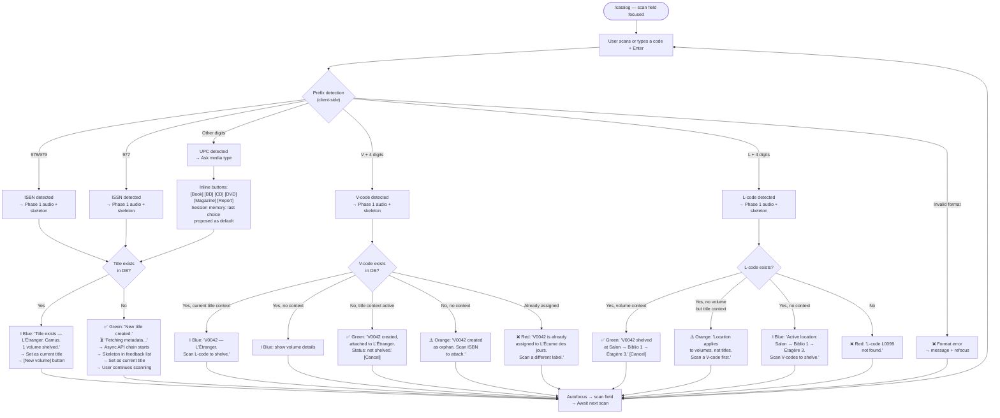

**Async metadata fetch behavior:**
- Each title's metadata fetch runs asynchronously through the API fallback chain (specialized API first → general APIs → timeout)
- Multiple fetches can run in parallel — 3+ skeletons can be visible simultaneously in the feedback list
- Each skeleton shows: "⏳ *Title created from ISBN 978-2-...* — Fetching metadata from BnF..." with a spinner
- When the first complete API response arrives, the skeleton is replaced by the full result (phase 2 audio plays)
- If all APIs fail or the global timeout expires (configurable, default 30 seconds), the skeleton is replaced by: "⚠️ *ISBN 978-2-...* — No metadata found. [Edit manually] [Retry]"
- The scan loop is never blocked — the user can scan 10 items while metadata fetches resolve in the background

**Key interaction details:**
- **Context banner** updates on each new title: `📖 Current: L'Étranger, Camus — 2 volumes, 1 shelved`
- **Cancel button** on last action persists until next scan (cancel-until-next-action pattern)
- **Feedback list**: green/blue entries fade after 10s, removed at 20s. Orange/red persist until dismissed or resolved
- **Session counter** visible: "48 items cataloged this session" — counter tied to HTTP session, survives page navigation, resets on next login
- **Manual entry**: Ctrl+N opens creation form — same form, same feedback, no code required
- **Duplicate ISBN**: distinct blue feedback + audio, title shown as current context. Explicit "New volume" button required — no automatic duplicate creation
- **UPC session memory**: after first media type choice, same type proposed as default for subsequent UPCs in the session
- **Concurrent label safety**: V-code uniqueness enforced at database level. Immediate rejection with details if already assigned
- **Pagination**: feedback list shows last 25 entries by default

### Journey 1b: Metadata Error Correction

**Entry point:** Librarian sees "N titles with metadata issues" tag on dashboard → clicks it.

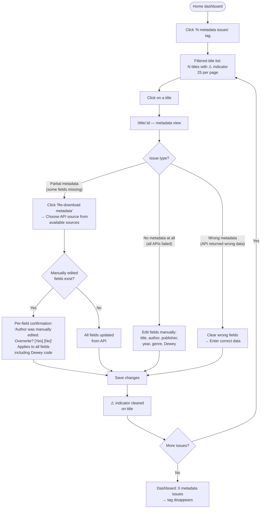

**Key interaction details:**
- No re-scanning needed — metadata correction is pure editing on /title/:id
- Per-field overwrite confirmation only when manually edited fields would be replaced (including Dewey code)
- Cover image: can be replaced independently from text metadata
- "Re-download metadata" triggers the API fallback chain again for the title's ISBN/UPC — user can select which source to use if multiple return results

### Journey 2: Remote Ownership Check

**Entry point:** Phone browser via Tailscale → mybibli home page. No login.

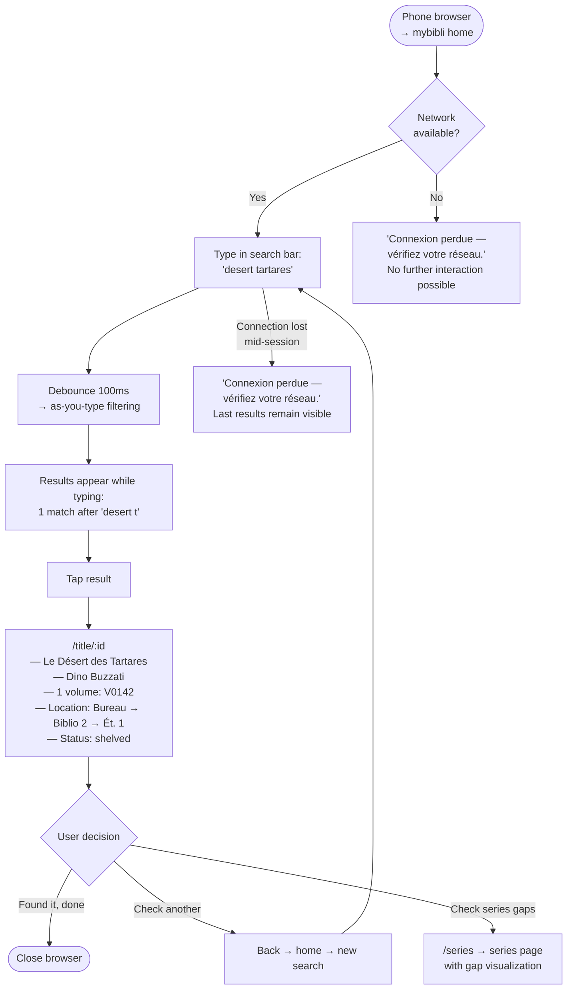

**Key interaction details:**
- Entire flow is anonymous — zero friction
- Search results show: title, author, media type icon, volume count
- Title detail shows location as breadcrumb path
- Loan status visible ("on loan" without borrower name for anonymous)
- Response target: < 500ms search, < 2s title detail load
- Connection loss: clear message in user's language, no technical jargon, last loaded content remains visible

### Journey 3: Marie Finds a DVD (Anonymous Casual User)

**Entry point:** Tablet browser → mybibli home. No login, no prior knowledge of the system.

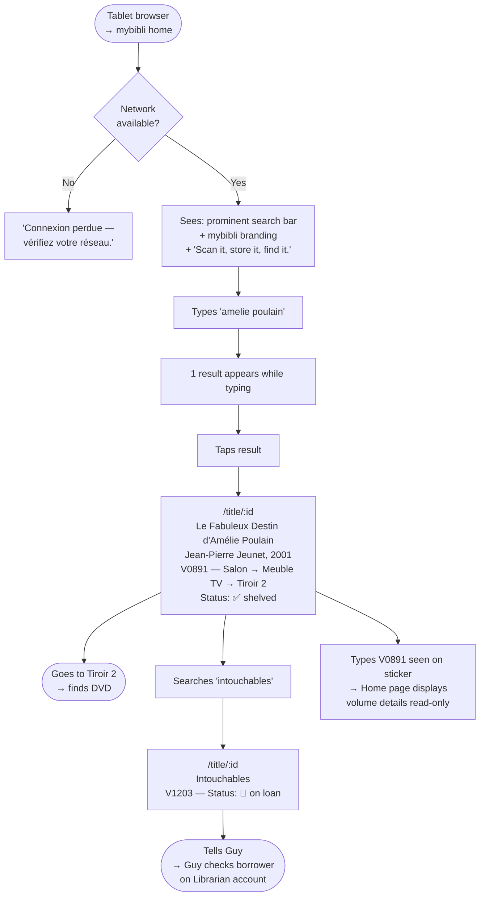

**Key interaction details:**
- Zero learning curve: search bar is the dominant element, placeholder text guides ("Search titles, authors...")
- No login prompt, no menu complexity for anonymous
- Volume status badge clearly distinguishes shelved (✅ green) vs on loan (📘 blue)
- Location displayed as clickable breadcrumb (tapping navigates to location contents)
- Touch targets 44×44px on tablet
- Typing a V-code or L-code on home page displays read-only details (no error — home page accepts any input)
- Connection loss: clear human-language message

### Journey 4: Loan Management

**Entry point:** Librarian on /title/:id clicks "Lend" on a volume, or navigates to /loans.

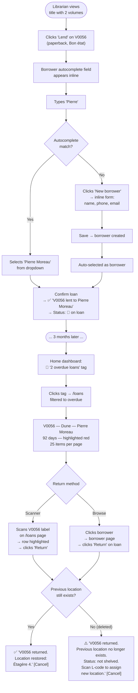

**Key interaction details:**
- Borrower autocomplete searches first + last name
- Inline borrower creation without leaving the current page
- Overdue threshold configurable by admin (default: 30 days)
- Return restores previous shelved location automatically — if previous location was deleted during loan, volume becomes "not shelved" with explanatory warning
- Cancel-until-next-action on return confirmation
- /loans page scan field: V-code → highlights matching loan row
- Borrower deletion: accessible from /borrowers page. Blocked if borrower has active loans ("Cannot delete: 1 active loan. Return loan first."). Modal confirmation if no active loans
- Pagination: 25 loans per page

### Journey 5: First-Time Setup

**Entry point:** Admin opens mybibli for the first time after docker-compose up.

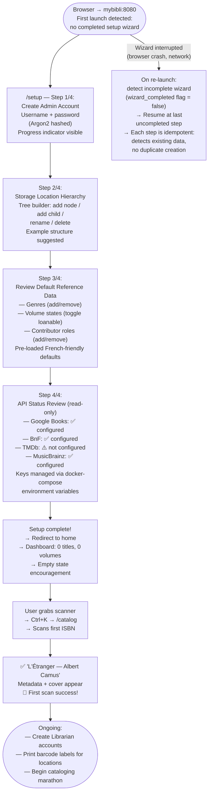

**Key interaction details:**
- Sequential wizard: each step has "Previous" / "Next" buttons, progress indicator (Step 1/4, 2/4, etc.)
- Pre-loaded defaults for genres, states, roles (French-friendly defaults)
- Storage hierarchy: tree builder with add node / add child / rename / delete
- API step 4: **read-only status display** — keys are configured via Docker environment variables, not in the UI. Shows connectivity status per API source (green check / yellow warning / gray disabled)
- First scan is the climax — target < 30 minutes from docker-compose to first successful scan
- Wizard appears only when no completed setup exists (checks `wizard_completed` flag, not just admin account existence)
- **Wizard steps are idempotent**: if interrupted and resumed, each step detects existing data (e.g., step 1 finds admin account already created → displays existing account with option to modify, not a blank creation form). No data loss on restart, no duplicate creation
- Location labels: barcode labels (Code 128), not QR codes. Generated individually per location (see Journey 8)

### Journey 6: Series Management

**Entry point:** Librarian on /title/:id clicks "Add to series", or navigates to /series.

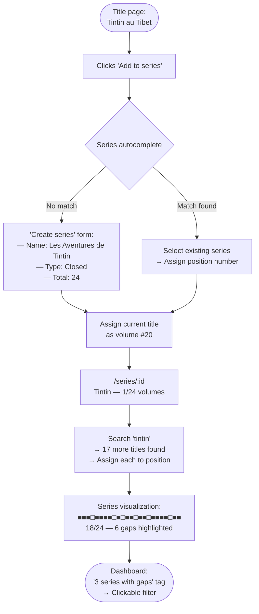

**Gap visualization detail:**
```
Les Aventures de Tintin (18/24)
■ 1  ■ 2  ■ 3  □ 4  ■ 5  ■ 6  ■ 7  ■ 8
□ 9  ■ 10 □ 11 ■ 12 ■ 13 □ 14 ■ 15 ■ 16
□ 17 ■ 18 ■ 19 ■ 20 ■ 21 □ 22 ■ 23 ■ 24

□ Missing: #4 Les Cigares du Pharaon, #9 Le Crabe aux pinces d'or...
```

**Key interaction details:**
- Filled squares (■): hover shows title + volume + location
- Empty squares (□): hover shows expected title if known from API
- Open series: shows "last known: #6, ongoing" instead of fixed total
- Series page: 25 items per page if series list exceeds threshold
- Soft-deleted titles are excluded from series view — gaps may appear temporarily for 30 days until purge, or until admin restores from Trash

### Journey 7: User Management (Admin)

**Entry point:** Admin navigates to /admin → Users tab.

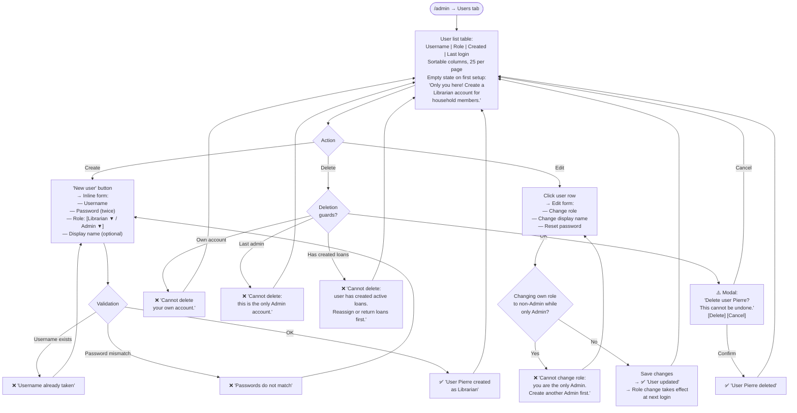

**Key interaction details:**
- Admin cannot delete their own account
- Cannot delete the last admin account
- Cannot demote self from Admin if sole Admin — must create another Admin first
- Role change takes effect on next login (current session unaffected)
- Password reset: admin sets new password, user must be informed out-of-band
- Destructive action (delete) → modal confirmation. Non-destructive (create, edit) → no modal
- Empty state on first visit: encouraging message for new admin

### Journey 8: Storage Location Management (Admin)

**Entry point:** Admin navigates to /admin → Reference Data tab → Locations section.

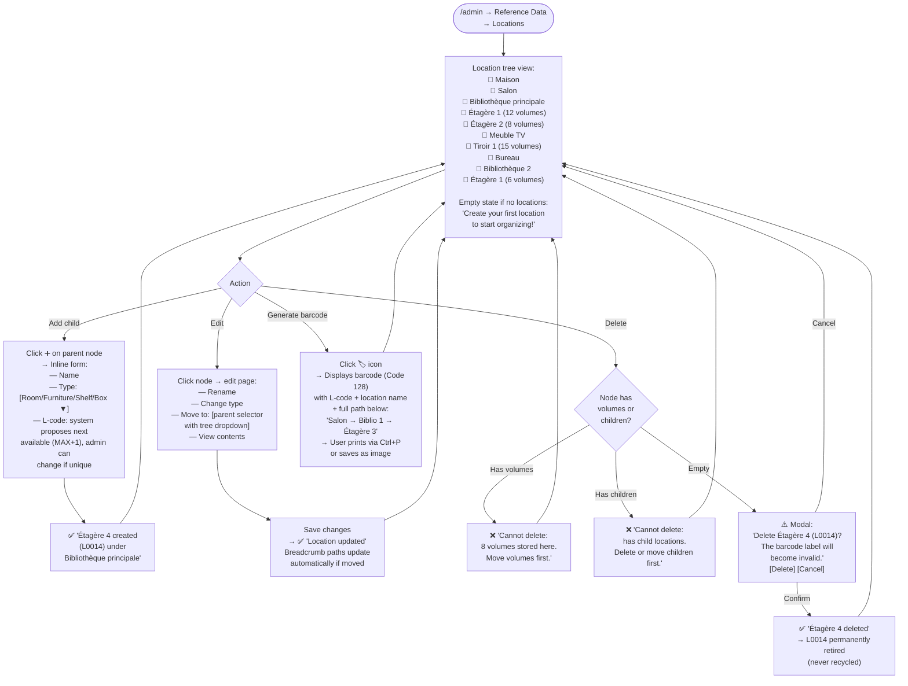

**Key interaction details:**
- Tree view is collapsible/expandable — admin can see the full hierarchy
- L-code format: strict `L` + 4 digits (L0001–L9999), same format as V-codes. System proposes next available (MAX+1 query), admin can choose any unused code
- L-codes are never recycled — a deleted L-code is permanently retired to avoid confusion with printed labels still physically present
- Node types configurable (admin can add custom types like "Box", "Drawer")
- Volume count shown per node — includes all descendants (recursive count)
- **Barcode generation**: Code 128 barcode (not QR code — L-codes are short numeric, 1D barcode is more compact and readable). Displayed as a dedicated page with barcode image + L-code text + full location path + location name. User prints one at a time via browser print (Ctrl+P) or saves the image
- **Move operation**: "Move to..." field with tree dropdown selector on the edit page. No drag-and-drop
- Breadcrumb paths update automatically when nodes are moved
- Empty state: encouraging message if no locations exist yet

### Journey 9: Reference Data Management (Admin)

**Entry point:** Admin navigates to /admin → Reference Data tab.

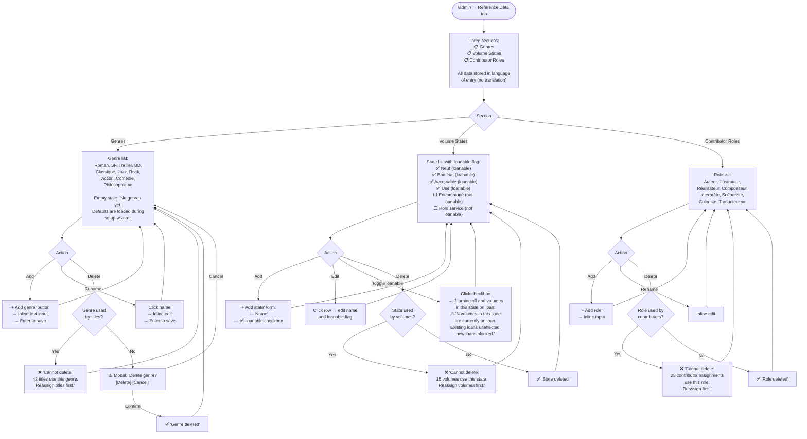

**Key interaction details:**
- All three sections follow the same pattern: list + add/rename/delete
- Inline editing for speed — no separate edit page
- Deletion blocked if entity is referenced (consistent with PRD deletion rules — count shown with link to blocking entities)
- Volume states: the "loanable" flag controls whether volumes in that state can be lent. Warning when disabling on a state with active loans — existing loans unaffected, new loans blocked
- Pre-loaded defaults on first launch (Journey 5), editable here afterward
- **No translation of reference data in v1** — genres, states, roles are stored in the language of entry. Same values displayed regardless of UI language
- No reordering in v1 — alphabetical display
- Empty states: encouraging message for each section if empty

### Journey 10: Browsing the Collection (Flânerie)

**Entry point:** Any user (anonymous or authenticated) arrives at home page or navigates to any content page.

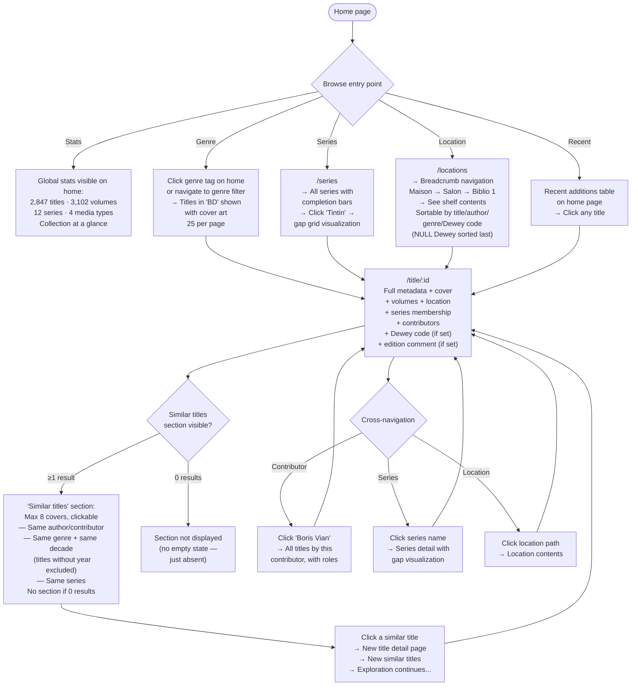

**Key interaction details:**
- **Non-linear by nature**: unlike other journeys, Browse has no fixed start/end. Multiple entry points, no "success criteria" — the experience IS the browsing itself
- **Cross-navigation creates a "Wikipedia effect"**: every entity mention is a clickable link. Title → contributor → other titles → series → gaps → another title. The user pulls a thread and explores for 20 minutes
- **Two browse display modes** (toggle, preference persisted):
  - **List mode**: cards with cover thumbnail left + title/author/genre right — informative
  - **Grid mode**: cover art grid — visual, library-like. Primary mode for pleasurable browsing
- **Similar titles** section on /title/:id: based purely on existing metadata (no recommendation algorithm):
  - Same author/contributor (any role)
  - Same genre + same publication decade (titles without publication year excluded from this criterion — no "unknown decade" bucket)
  - Same series (other volumes)
  - Maximum 8 cover thumbnails displayed
  - Section completely absent if no matches found (no empty state — avoids sadness during pleasurable browsing)
- **Cover art is the primary visual element** in Browse mode — grid/card layouts with covers front and center
- **Covers in dark mode**: light shadow around cover images to integrate them visually against the dark background
- **Location content view**: sortable by title, author, genre, and Dewey code. Dewey sort places titles with Dewey code first (ascending), titles without Dewey grouped at end (NULL last). Enables verifying physical shelf order matches catalog order
- **Empty collection**: encouraging empty states per page ("No titles yet — start cataloging to see your collection here!")
- **Soft-deleted items**: completely invisible in all browse views. Visible only in /admin → Trash
- Pagination: 25 items per page on all list views

### Admin Trash Page

**Entry point:** Admin navigates to /admin → Trash tab.

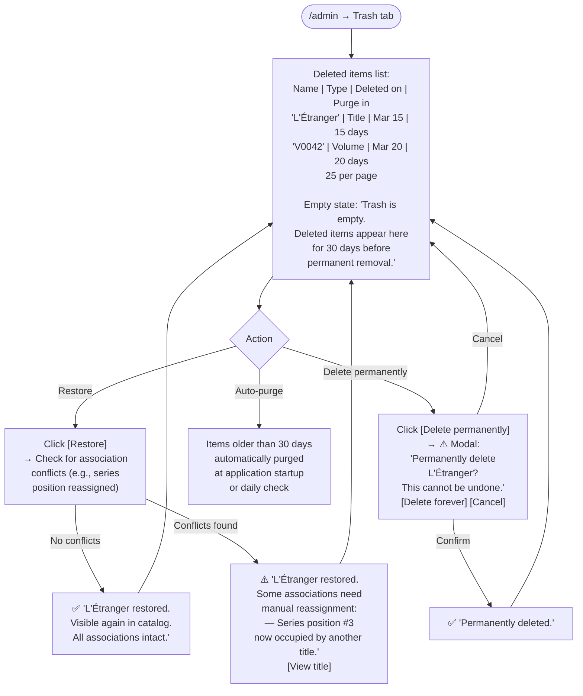

**Key interaction details:**
- Admin-only page — accessible via /admin → Trash tab
- Admin tabs: Health, Users, Reference Data, **Trash (N)**, System — 5 tabs. Trash tab shows item count badge when non-empty (e.g., "Trash (3)"). Badge disappears when trash is empty
- Shows all soft-deleted entities: titles, volumes, borrowers, series, locations, contributors
- Each item shows: name, type, deletion date, days remaining before auto-purge
- Restore: item becomes visible again in all views. Most associations preserved automatically. If associations have changed during deletion period (e.g., another title assigned to the same series position), the restore succeeds but conflicting associations require manual reassignment — a warning is displayed with details of what needs attention
- Permanent delete: modal confirmation, irreversible
- Auto-purge: items older than 30 days removed at application startup or daily scheduled check
- Pagination: 25 items per page
- Empty state: encouraging message when trash is empty

### Journey Patterns

**Common patterns across all journeys:**

**Navigation patterns:**
- **Tag-to-filter**: dashboard tags on home page act as instant filters (unshelved, overdue, metadata issues, series gaps). Click tag → filtered view. ✕ to clear filter. Shareable URL
- **Entity cross-navigation**: every entity mention is a clickable link. Feedback entry mentions "L'Étranger" → click navigates to /title/:id. Title page mentions "Salon → Biblio 1" → click navigates to /locations/:id. Consistent across all pages
- **Contextual entry points**: same workflow accessible from multiple places. Return a loan: from /loans (scan), from borrower page (click), from title page (click on volume). Delete a borrower: from /borrowers page
- **Browse as discovery**: non-linear navigation through cross-links creates a Wikipedia-like exploration experience. The collection becomes an object of pride, not just a database

**Interaction patterns:**
- **Inline-first editing**: reference data, user details, location names — all editable inline without navigation. Forms appear in place, Enter to save, Escape to cancel
- **Autocomplete for associations**: borrower selection, series assignment, genre assignment — all use type-ahead autocomplete with "Create new" option at the bottom of the dropdown
- **Scan-as-shortcut**: on /loans, scanning a V-code finds and highlights the loan. On /catalog, scanning anything triggers the appropriate action. The scanner accelerates but never replaces — every scan action is also achievable via clicks and typing

**Protection patterns:**
- **Cascading deletion blocks**: delete location → check volumes. Delete genre → check titles. Delete user → check loans. The system always explains what must be resolved first, with a count and a link to the blocking entities
- **Modal only for destruction**: create, edit, assign, scan → never a modal. Delete, dissociate → modal with explicit details of what will be lost. Blocked actions → explanatory message, no modal
- **Loanable state guard**: toggling "loanable" off on a volume state warns about existing loans. Existing loans unaffected (no retroactive enforcement), new loans blocked
- **Self-protection guards**: admin cannot delete own account, cannot delete last admin, cannot demote self from Admin if sole Admin
- **Soft delete safety net**: all deletions are soft (30-day retention). Admin Trash page provides visual restore/permanent-delete with conflict detection on restore. Auto-purge after 30 days

**Consistency patterns:**
- **Pagination**: 25 items per page across all list views (titles, volumes, loans, borrowers, series, locations, users, trash). Fixed in v1, not user-configurable
- **Empty states**: every page has a contextual encouragement message when empty, consistent with the "zero to value in minutes" principle
- **Connection loss**: "Connexion perdue — vérifiez votre réseau" displayed on any page when network is unavailable. Last loaded content remains visible. No technical jargon

### Flow Optimization Principles

1. **Minimum taps to value**: cataloging = 2 scans (ISBN + V-code). Shelving = 2 scans (V-code + L-code). Loan = 2 actions (click Lend + select borrower). Return = scan + click. No workflow exceeds 3 interactions for its primary success path.

2. **Context persistence reduces repetition**: batch shelving retains active location (scan L-code once, then V-codes). UPC disambiguation remembers last choice (scan 5 CDs without choosing "CD" each time). Current title context persists until changed.

3. **Async everything, block nothing**: metadata fetches run in background with visible progress in the feedback list. Multiple parallel fetches supported. The scan loop is never blocked — errors and pending items are visible but non-interrupting. Global timeout is generous (default 30s) because the user is never waiting.

4. **Error visibility without interruption**: all journeys follow the same error pattern — errors appear in the feedback list or inline, never as blocking modals during productive workflows. The user decides when to address errors (now or later).

5. **Progressive complexity by role**: anonymous users see the simplest flows (search → view → browse). Librarians add action capabilities (scan → create → lend). Admin adds configuration capabilities (manage users, locations, reference data, trash). Same pages, additive features.

6. **Consistency breeds trust**: every entity type follows the same CRUD pattern (list → detail → edit inline). Every deletion follows the same guard pattern (check references → block or confirm → soft delete → trash). Every scan follows the same four-phase feedback. Users learn the system once and apply the mental model everywhere.

7. **The collection as an object of pride**: Browse mode, cover art prominence, series gap visualization, similar titles, cross-navigation, list/grid toggle — these features transform mybibli from a utility into a showcase. The emotional payoff of browsing a well-organized collection reinforces the motivation to catalog more.

### Decisions Deferred to PRD Update

The following decisions emerged during UX journey design and must be reflected in the PRD:

| Decision | Impact |
|----------|--------|
| Dewey code: optional field on Title, pre-filled by API (BnF), used for physical sort order only — not searchable, not filterable. NULL values sorted last | Data model: add `dewey_code` field to titles table |
| Edition comment: free-text field on Volume, entered during post-cataloging editing, not during scan loop | Data model: confirm field exists on volumes table |
| L-codes use barcode (Code 128), not QR code | Label generation specification |
| API keys: environment variables only, not configurable in UI | Architecture: no secrets storage in database |
| Admin tabs: Health, Users, Reference Data, Trash (N), System (5 tabs) | Page structure update |
| Soft delete with admin Trash page (restore with conflict detection, permanent delete, auto-purge 30 days) | Architecture: soft delete pattern across all entities |
| Reference data not translated in v1 | i18n scope limitation |
| Pagination: 25 items fixed, not configurable in v1 | Implementation simplification |
| Similar titles: metadata-based (same author/genre+decade/series), max 8, no ML. Titles without publication year excluded from decade matching | Feature specification |
| Cover images: light shadow in dark mode | Visual design detail |
| Browse display: list/grid toggle, preference persisted per user | Feature specification |
| Borrower deletion: accessible from /borrowers, blocked if active loans, modal confirmation | Feature specification not in current PRD |
| Session counter: tied to HTTP session, survives page navigation, resets on login | New UI element not in current PRD |
| Trash tab badge: item count shown when non-empty | UI detail |
| Setup wizard: steps are idempotent (handle restart gracefully) | Architecture requirement |
| Async metadata: global timeout configurable (default 30s), multiple parallel fetches, never blocks scan loop | Architecture requirement |

## Component Strategy

### Fusion Analysis

Before specifying individual components, behavioral analysis identified 5 groups of components that share enough structure to be merged:

| Fusion | Components Merged | Rationale |
|--------|------------------|-----------|
| **Cover** | Cover image + Cover placeholder + Cover shimmer | Same element in three states: loading (shimmer), missing (placeholder SVG), loaded (image). One component, three states. |
| **FilterTag** | Dashboard tag + Filter badge | The tag IS the filter trigger. When clicked, it becomes the active filter badge with ✕. Same data, two visual states of one component. |
| **StatusMessage** | Empty state + Connection lost message | Both are full-area contextual messages displayed when primary content is unavailable. Connection lost is a variant with a specific icon and message. |
| **CatalogToolbar** | Context banner + Session counter | Both live in the same /catalog area above the feedback list. Grouping them as one compound component avoids layout fragmentation. |
| **FeedbackEntry** | Feedback entry + Skeleton/shimmer | Skeleton is the loading state of a feedback entry. Same list, same position, same dimensions — the skeleton transforms into the final entry when data arrives. |

**Result: 24 components** (5 fusions from 29 original candidates).

### Component Specifications

#### 1. ScanField — Intelligent Input

**Purpose:** Primary input for barcode scanning and manual code/text entry. The most-used element in mybibli — every cataloging and shelving action starts here.

**Usage:** Present on /catalog (primary), /loans, and / (home search variant).

**Anatomy:**
```
┌─────────────────────────────────────────────────────────┐
│ 🔍  [                                        ] [▼] [+] │
│      placeholder: "Scan or type: ISBN, V-code,          │
│                    L-code, or search..."                 │
└─────────────────────────────────────────────────────────┘
       ↑input field          ↑expand toggle  ↑new title
```

**Collapsed mode** (default): single unified field. Prefix detection automatic.
**Expanded mode** (toggle): three labeled fields side by side — ISBN/UPC, Volume code, Location code. Each field validates its specific format. User preference persisted.

**Content:**
- Input text (user-typed or scanner-injected)
- Placeholder text (context-dependent per page)
- Expand/collapse toggle icon (▼/▲)
- New title shortcut button (+) — /catalog only, Librarian+ only

**States:**

| State | Visual | Behavior |
|-------|--------|----------|
| Empty / Ready | Border `--color-border`, placeholder visible | Autofocused. Awaiting input |
| Focused | 2px `--color-primary` focus ring, `--shadow-sm` | Cursor blinking, ready for input |
| Input detected | Border unchanged | Client-side prefix detection running on each keystroke |
| Processing | Brief spinner icon right-aligned inside field | Server request in flight (< 300ms typical) |
| Error (invalid format) | 2px `--color-danger` border, shakes once (150ms) | Returns to Ready after shake. `prefers-reduced-motion`: no shake, border flash only |
| Disabled | 50% opacity, `cursor: not-allowed` | During modal dialogs (destructive confirmations) |

**Variants:**

| Variant | Page | Type | Differences |
|---------|------|------|------------|
| Catalog scan field | /catalog | `type="text"` | Collapsed/expanded toggle, + button, processes on Enter, no as-you-type |
| Loans scan field | /loans | `type="text"` | No toggle, no + button, processes on Enter, V-code only behavior |
| Home search field | / | `type="search"` | Larger size (h-14), no toggle, no + button, as-you-type with debounce, no creation logic. Centered on page, dominant visual element. Native browser clear button via search type |

**Accessibility:**
- `role="search"` on home variant, `role="textbox"` on catalog/loans
- `aria-label="Scan barcode or type code"` (catalog), `"Search titles, authors, series"` (home)
- `aria-live="polite"` on associated status text below field (announces what was detected)
- `aria-expanded` on collapse/expand toggle
- Keyboard: Enter submits, Escape clears field and returns focus, Tab moves to expand toggle then + button
- **Autofocus dual mechanism**: `autofocus` HTML attribute for first page load + `hx-on::after-settle` for HTMX swap restoration. Both required — HTML autofocus alone doesn't work after swaps, HTMX attribute alone doesn't work on first load

**Interaction Behavior:**
- Scanner input: rapid character burst (< 100ms between keystrokes) terminated by Enter. Field captures all characters, Enter triggers processing
- Keyboard input on /catalog: user types at normal speed, Enter triggers processing. No as-you-type filtering
- Keyboard input on /: debounce (100ms configurable), as-you-type filtering after debounce period. Enter optional (results already visible)
- After processing: field clears, autofocus returns, ready for next input
- Expand/collapse: toggle persists preference in localStorage (anonymous) or user profile (authenticated)

---

#### 2. FeedbackEntry — Scan Result with Loading State

**Purpose:** Displays the result of every scan/action on /catalog and /loans. The primary feedback mechanism — users read these at high speed during marathon cataloging. Also serves as the loading skeleton while metadata fetches are in progress.

**Usage:** Feedback list on /catalog and /loans. Newest entry at top.

**Anatomy:**
```
┌──────────────────────────────────────────────────────────┐
│ ▌ ✅ Volume V0042 attached to L'Étranger by Camus.      │
│ ▌    → Scan L-code to shelve.                   [Cancel] │
└──────────────────────────────────────────────────────────┘
 ↑4px    ↑icon  ↑main message                     ↑action
 border         ↑suggestion (muted)
```

**Loading skeleton variant:**
```
┌──────────────────────────────────────────────────────────┐
│ ▌ ⏳ Title created from ISBN 978-2-07-036024-8           │
│ ▌    Fetching metadata from BnF...            ░░░░░░░░░ │
└──────────────────────────────────────────────────────────┘
 ↑4px    ↑spinner  ↑message                      ↑shimmer bar
 border (muted)
```

**Content:**
- Colored left border (4px)
- Status icon (SVG inline)
- Main message (specific, with full context — title name, author, volume code, location path). Codes in `--font-mono`
- Suggestion line (muted text, context-dependent next action)
- Action button(s): [Cancel] for last resolved entry, [Edit manually] [Retry] for errors, [Create] [Dismiss] for not-found
- Timestamp (caption size, muted, optional — visible on hover)

**States:**

| State | Border Color | Icon | Lifecycle | Audio |
|-------|-------------|------|-----------|-------|
| Loading/Skeleton | `--color-border` (muted) | ⏳ spinner | Persists until API response or timeout | None |
| Success (new) | `--color-success` green | check-circle | Fade after 10s, remove at 20s | Confirmation tone (Web Audio oscillator) |
| Info (existing) | `--color-info` blue | info-circle | Fade after 10s, remove at 20s | Soft info tone |
| Warning | `--color-warning` amber | alert-triangle | Persists until dismissed | Alert tone |
| Error | `--color-danger` red | x-circle | Persists until dismissed | Error tone |
| Fading | Any (opacity transitioning) | Same | Opacity 1→0 over 10s (starts at 10s mark) | None |
| With Cancel | Any | Same | [Cancel] button visible on **last resolved entry** — disappears when next result resolves | None |

**Timer management:** A single `setInterval(1000)` on the feedback list container manages all entry lifecycles — iterates visible entries, updates fade progress, removes expired entries. No per-entry `setTimeout`. Efficient for 50+ concurrent entries during marathon sessions.

**Cancel button semantics:** Cancel appears on the **last resolved result**, not the last initiated scan. If scans #1, #2, #3 are initiated but #2 resolves first, Cancel appears on #2. When #3 resolves, Cancel moves to #3. This ensures the user cancels the most recent completed action, not a still-pending one.

**Variants:**

| Variant | Difference |
|---------|-----------|
| Standard | As described above |
| Compact (mobile) | Single line, truncated message with expand on tap |
| Title summary | Appears when context changes: "✅ L'Étranger — 2 volumes created, 1 shelved. [View title]" |

**Accessibility:**
- Feedback list container: `aria-live="polite"`, `aria-relevant="additions"` — screen reader announces new entries
- Each entry: `role="status"`, `aria-label` includes full message text
- [Cancel] button: `aria-label="Cancel last action: [action description]"`
- Dismiss button on warnings/errors: `aria-label="Dismiss this message"`
- Color is never sole channel: border + icon + text (three redundant channels)
- `prefers-reduced-motion`: no fade animation, entries simply disappear at 20s mark

**Interaction Behavior:**
- New entries appear at top of list (prepend), push older entries down
- Multiple skeleton entries can coexist (parallel metadata fetches)
- Skeleton → final state transition: skeleton is replaced in-place by the resolved entry (same DOM position)
- [Cancel] button: only on the most recent resolved entry. Clicking Cancel reverses the action, removes the entry, and refocuses scan field
- Success/info entries: fade-out starts at 10s (opacity transition 10s), removed from DOM at 20s
- Warning/error entries: persist until user clicks [Dismiss], [Edit manually], [Retry], or [Create]
- Feedback list shows last 25 entries. Older entries are removed from DOM (not paginated)
- Audio: generated programmatically via Web Audio API oscillators — four distinct frequency/pattern combinations. Zero external audio assets. Plays on entry appearance if audio toggle is enabled

---

#### 3. CatalogToolbar — Context Banner + Session Counter

**Purpose:** Compound component providing persistent contextual information during cataloging sessions. Shows what title/location is currently active and how many items have been processed.

**Usage:** /catalog page only, between scan field and feedback list.

**Anatomy:**
```
┌──────────────────────────────────────────────────────────┐
│ 📖 Current: L'Étranger, Camus — 2 vol, 1 shelved       │
│ 📍 Active location: Salon → Biblio 1 → Étagère 3        │
│                                    42 items this session │
└──────────────────────────────────────────────────────────┘
 ↑current title line          ↑session counter (right-aligned)
 ↑active location line (only during batch shelving)
```

**Content:**
- Current title line: media type icon + title name + author + volume count + shelved count
- Active location line: location icon + full breadcrumb path (only visible during batch shelving — after scanning an L-code without a preceding V-code)
- UPC session type line: "🎵 CD mode active" (only visible after UPC disambiguation, shows remembered media type)
- Session counter: right-aligned, caption size, "N items this session"

**States:**

| State | Display |
|-------|---------|
| No context | Toolbar hidden — no current title, no active location, counter at 0 |
| Title context only | Title line visible, location line hidden |
| Title + location context | Both lines visible |
| Location context only (batch shelving) | Location line visible, title line hidden |
| UPC session type active | Additional line showing remembered media type |

**Variants:** None — single variant, content-driven display.

**Accessibility:**
- `aria-live="polite"` — announces context changes (new title, new location)
- `aria-label="Cataloging context"` on container
- Title and location names are readable text, not just icons
- Session counter: `aria-label="42 items cataloged this session"`

**Interaction Behavior:**
- Title line updates when a new ISBN/UPC is scanned and a title is created or found
- Previous title automatically summarized in feedback list when context changes
- Location line appears when L-code scanned without volume context, disappears when context is cleared
- Session counter increments on each successful title creation or volume creation
- Counter tied to HTTP session — survives page navigation, resets on next login
- Clicking title name navigates to /title/:id. Clicking location navigates to /locations/:id

---

#### 4. FilterTag — Dashboard Tag + Active Filter Badge

**Purpose:** Dual-state component that serves as both a clickable dashboard indicator (tag with count) and an active filter indicator (badge with ✕). The tag IS the filter — clicking it activates the filter, and the tag transforms into a badge showing the active filter.

**Usage:** Home page dashboard (Librarian view), filtered list views.

**Anatomy — Tag state (inactive):**
```
  ┌─────────────────────┐
  │ ⚠️ 5 unshelved      │     ← pill shape, clickable
  └─────────────────────┘
```

**Anatomy — Badge state (active filter):**
```
  ┌─────────────────────────┐
  │ ⚠️ 5 unshelved      ✕  │     ← pill shape, ✕ to clear
  └─────────────────────────┘
```

**Content:**
- Status icon (matches feedback color system)
- Count (integer)
- Label text (descriptive: "unshelved", "overdue loans", "metadata issues", "series with gaps")
- ✕ clear button (badge state only)

**States:**

| State | Visual | Behavior |
|-------|--------|----------|
| Tag (inactive) | Pill shape, muted background, colored icon + text | Clickable. On click → applies filter, transforms to Badge |
| Tag hover | Background slightly darkened | Cursor: pointer |
| Badge (active) | Pill shape, colored background (light tint of status color), ✕ visible | ✕ clears filter, returns to Tag state |
| Badge hover on ✕ | ✕ darkens | Cursor: pointer on ✕ area |
| Zero count | Hidden — tag not displayed | No visual presence if count is 0 |

**Variants:**

| Variant | Color | Icon | Label examples |
|---------|-------|------|---------------|
| Warning | `--color-warning` amber | alert-triangle | "N unshelved", "N metadata issues" |
| Danger | `--color-danger` red | x-circle | "N overdue loans" |
| Info | `--color-info` blue | info-circle | "N recent additions" |
| Gap | `--color-warning` amber | alert-triangle | "N series with gaps" |

**Accessibility:**
- Tag: `role="link"`, `aria-label="Filter by: 5 unshelved volumes"`
- Badge: `role="status"`, `aria-label="Active filter: unshelved volumes. Press to remove filter"`
- ✕ button: `aria-label="Remove filter"`
- Keyboard: Enter/Space activates tag. Tab reaches ✕ on badge. Enter/Space on ✕ clears filter

**Interaction Behavior:**
- Clicking tag: applies filter to the current page's list view (e.g., `/?filter=unshelved`). URL updates (shareable). Tag becomes Badge
- Clicking ✕ on badge: removes filter, URL updates, Badge becomes Tag
- Multiple tags can be visible simultaneously on the dashboard. Only one filter active at a time — clicking a new tag replaces the previous filter
- Tags disappear when their count reaches 0
- Counts updated via HTMX OOB swap when underlying data changes

---

#### 5. DataTable — Sortable List with Pagination

**Purpose:** Standard table for displaying entity lists across the application. Sortable columns, responsive column hiding, clickable rows, and classic pagination.

**Usage:** Title lists, volume lists, loan lists, borrower lists, user lists, trash items, location contents, search results.

**Anatomy:**
```
┌──────────────────────────────────────────────────────────┐
│  Title ▲        │ Author      │ Genre  │ Status │ Loc    │
├──────────────────────────────────────────────────────────┤
│ 📖 L'Étranger   │ A. Camus    │ Roman  │ ✅     │ Ét. 3  │
│ 📖 Dune          │ F. Herbert  │ SF     │ 📘     │ —      │
│ 🎵 Kind of Blue  │ M. Davis    │ Jazz   │ ✅     │ Tiroir │
├──────────────────────────────────────────────────────────┤
│                          ◀ 1 2 3 ... 12 ▶               │
└──────────────────────────────────────────────────────────┘
 ↑media icon + cover thumb  ↑sortable       ↑status badge  ↑pagination
```

**Content:**
- Column headers (sortable: click to toggle asc/desc, ▲/▼ indicator)
- Row cells with entity data
- Optional cover thumbnail (40×60px) in first column
- Media type icon per row
- Status badge per row (volume status, loan status)
- Pagination bar (page numbers, previous/next arrows, current page highlighted)

**States:**

| State | Visual | Behavior |
|-------|--------|----------|
| Default | Table with data, first column sorted ascending | Interactive |
| Loading (HTMX swap) | Opacity 0.7 on table body + small spinner centered over tbody | New content replaces old on resolve |
| Empty | StatusMessage component (empty state variant) replaces table body | Encouraging message |
| Sort active | Active column header: bold, ▲ or ▼ indicator | Click toggles direction, click different column changes sort |
| Row hover | Row background slightly darkened | Cursor: pointer (entire row clickable) |
| Row focused | 2px `--color-primary` outline on row | Keyboard navigation support |

**Sort + pagination interaction:** Changing the sort column or direction **always resets pagination to page 1**. This prevents disorienting the user with a page N of a completely different ordering.

**Responsive behavior:**

| Breakpoint | Columns shown | Adaptation |
|------------|--------------|------------|
| Desktop (≥1024px) | All columns | Full table |
| Tablet (768-1023px) | Hide least-important columns (configurable per usage context) | 3-4 columns |
| Mobile (<768px) | 2 columns: primary identifier + status | Card-like rows if needed |

**Variants:**

| Variant | Differences |
|---------|------------|
| Standard | Clickable rows → detail page |
| Admin | Clickable rows → edit form. Action buttons per row (edit, delete) |
| Compact | No cover thumbnails, smaller row height. Used in modals and side panels |
| LoanRow | Specialized row behavior for /loans: scan-to-highlight (V-code scan highlights matching row with 1s amber flash), contextual [Return] button per row, duration display with color coding (normal text < 14 days, `--color-warning` 14-29 days, `--color-danger` ≥ 30 days based on admin overdue threshold) |

**Accessibility:**
- `<table>` with proper `<thead>`, `<tbody>`, `<th scope="col">`
- Sortable headers: `aria-sort="ascending"` / `"descending"` / `"none"`
- `aria-label` on table: describes content ("Title list", "Active loans")
- Row click: `role="link"` or actual `<a>` wrapping the row for keyboard navigation
- Pagination: `<nav aria-label="Pagination">`, current page `aria-current="page"`
- Keyboard: Tab to reach table, arrow keys to navigate rows, Enter to open detail, Tab to pagination
- LoanRow highlight: `aria-live="polite"` announces matched loan on scan

**Interaction Behavior:**
- Column sort: click header to sort. HTMX request reloads table body with sorted data. URL updates with sort parameter (shareable). Pagination resets to page 1
- Row click: navigates to entity detail page (/title/:id, /borrowers/:id, etc.)
- Pagination: 25 items per page (fixed v1). HTMX swap on table body. URL updates with page parameter
- Filter integration: FilterTag applies query parameter, table reloads filtered data
- LoanRow scan-to-highlight: when a V-code is scanned on /loans, the matching row receives a 1-second amber background flash, then settles to a subtle highlight. The [Return] button on that row becomes prominently visible

---

#### 6. NavigationBar — Role-Aware Top Bar

**Purpose:** Global navigation bar present on every page. Shows role-appropriate links, language toggle, theme toggle, and user identity.

**Usage:** Every page, fixed position at top.

**Anatomy:**
```
┌──────────────────────────────────────────────────────────────────┐
│ mybibli    Catalog  Loans  Series  Locations  Admin    🌙 FR Guy │
└──────────────────────────────────────────────────────────────────┘
 ↑logo/home  ↑nav links (role-filtered)         ↑theme ↑lang ↑user
```

**Content:**
- Logo/brand text ("mybibli") — link to home
- Navigation links: context-dependent by role
- Theme toggle (sun/moon icon)
- Language toggle (FR/EN)
- User display name (authenticated) or nothing (anonymous)

**Role-based link visibility:**

| Link | Anonymous | Librarian | Admin |
|------|-----------|-----------|-------|
| Home (/) | ✅ (logo) | ✅ (logo) | ✅ (logo) |
| Catalog (/catalog) | — | ✅ | ✅ |
| Loans (/loans) | — | ✅ | ✅ |
| Series (/series) | ✅ | ✅ | ✅ |
| Locations (/locations) | ✅ | ✅ | ✅ |
| Borrowers (/borrowers) | — | ✅ | ✅ |
| Admin (/admin) | — | — | ✅ |
| Login | ✅ | — | — |
| Logout | — | ✅ | ✅ |

**States:**

| State | Visual |
|-------|--------|
| Default | Neutral background, links in `--color-text` |
| Active link | `--color-primary` text + bottom border (2px) on current page link |
| Link hover | Text darkens slightly |
| Mobile | Hamburger menu (☰), opens vertical overlay with all links |
| Theme toggle | Sun icon (light mode) / Moon icon (dark mode) |

**Dimensions:**
- Desktop: height 48px, horizontal layout
- Tablet/mobile: height 56px (larger touch targets), hamburger menu

**Accessibility:**
- `<nav aria-label="Main navigation">`
- Active page: `aria-current="page"`
- Theme toggle: `aria-label="Switch to dark mode"` / `"Switch to light mode"`
- Language toggle: `aria-label="Changer la langue / Change language"`
- Mobile hamburger: `aria-expanded="true/false"`, `aria-controls="nav-menu"`
- Skip link: hidden "Skip to main content" link as first focusable element

**Interaction Behavior:**
- Fixed position (always visible during scroll)
- Theme toggle: switches `dark` class on `<html>`, persists preference
- Language toggle: HTMX swap of full page content in new language, immediate switch
- Ctrl+K shortcut: navigates to /catalog (if Librarian/Admin). Visual hint on Catalog link hover: "Ctrl+K"
- Ctrl+L shortcut: navigates to /loans

---

#### 7. AdminTabs — Flat Tab Bar with Badge

**Purpose:** Horizontal tab navigation for the /admin page. Flat organization, no nesting — direct access to all admin sections.

**Usage:** /admin page only, below page title.

**Anatomy:**
```
┌──────────────────────────────────────────────────────────┐
│  Health    Users    Reference Data    Trash (3)   System │
│  ═══════                                                 │
└──────────────────────────────────────────────────────────┘
 ↑active tab (primary bottom border)            ↑badge count
```

**Content:**
- 5 tab labels: Health, Users, Reference Data, Trash, System
- Badge count on Trash tab (only when > 0 items in trash)

**States:**

| State | Visual |
|-------|--------|
| Active tab | `--color-primary` bottom border (3px), bold text |
| Inactive tab | Normal text, no border |
| Tab hover | Background slightly darkened |
| Tab focused | 2px `--color-primary` focus ring |
| Trash badge | Small `--color-danger` pill with count next to "Trash" label. Hidden when 0 |

**Accessibility:**
- `role="tablist"` on container
- Each tab: `role="tab"`, `aria-selected="true/false"`, `aria-controls="panel-id"`
- Tab panels: `role="tabpanel"`, `aria-labelledby="tab-id"`
- Keyboard: arrow keys navigate between tabs, Enter/Space activates tab
- Trash badge: `aria-label="Trash, 3 items"`

**Interaction Behavior:**
- Tab click: HTMX swaps tab panel content. URL updates with tab identifier (`/admin?tab=trash`)
- Tab state persisted in URL — direct linking to specific admin tab supported
- Badge updates dynamically via HTMX OOB swap when items are deleted or restored

---

#### 8. Modal — Destructive Confirmation + Warning

**Purpose:** Dialog for destructive action confirmations and non-destructive warnings. Never used during cataloging, scanning, or productive workflows.

**Usage:** Delete confirmations (user, location, genre, state, role, borrower, permanent delete from trash). Warnings (loanable flag toggle with active loans).

**Anatomy — Destructive:**
```
         ┌────────────────────────────────────────┐
         │  ⚠️ Delete user Pierre?                │
         │                                        │
         │  This cannot be undone.                 │
         │                                        │
         │              [Cancel]  [Delete]         │
         └────────────────────────────────────────┘
───────── semi-transparent backdrop ─────────────
```

**Anatomy — Warning/Info:**
```
         ┌────────────────────────────────────────┐
         │  ℹ️ Loanable flag disabled              │
         │                                        │
         │  3 volumes in this state are currently  │
         │  on loan. Existing loans unaffected,    │
         │  new loans blocked.                     │
         │                                        │
         │                          [Understood]   │
         └────────────────────────────────────────┘
───────── semi-transparent backdrop ─────────────
```

**Content:**
- Icon (warning for destructive, info for warning)
- Title (action description)
- Description (consequence explanation)
- Button(s): Cancel + Confirm (destructive) or single OK/Understood (warning)

**States:**

| State | Visual |
|-------|--------|
| Opening | Fade-in (150ms) backdrop + modal |
| Open | Backdrop `rgba(0,0,0,0.5)`, modal centered, `--shadow-md` |
| Closing | Fade-out (150ms) |

**Variants:**

| Variant | Buttons | Confirm style | Initial focus |
|---------|---------|--------------|---------------|
| Delete | [Cancel] + [Delete] | `--color-danger` background | Cancel |
| Delete forever | [Cancel] + [Delete forever] | `--color-danger` background | Cancel |
| Remove | [Cancel] + [Remove] | `--color-danger` background | Cancel |
| Warning | [Understood] only | `--color-primary` background | Understood |

**Accessibility:**
- `role="dialog"`, `aria-modal="true"`, `aria-labelledby` points to title
- Focus trapped inside modal (Tab cycles between buttons)
- Initial focus: Cancel button for destructive variants (safe default), Understood for warning
- Escape key closes modal (same as Cancel / Understood)
- Backdrop click closes modal
- `prefers-reduced-motion`: no fade animation, instant appear/disappear

**Interaction Behavior:**
- Opens above all other content (z-index 40, backdrop z-index 30)
- Scan field loses focus while modal is open — no accidental scans during confirmation
- Cancel: closes modal, returns focus to triggering element
- Confirm: executes destructive action, closes modal, updates parent view via HTMX

---

#### 9. AutocompleteDropdown — Type-Ahead with Inline Creation

**Purpose:** Type-ahead search dropdown for associating entities. Supports selecting existing items or creating new ones inline without leaving the current page.

**Usage:** Borrower selection (loans), series assignment (title page), genre assignment, contributor assignment.

**Anatomy:**
```
  ┌──────────────────────────────┐
  │ Pier█                        │   ← input field
  ├──────────────────────────────┤
  │ Pierre Moreau                │   ← match (highlighted)
  │ Pierre-Henri Dumont          │   ← match
  ├──────────────────────────────┤
  │ + Create "Pier..."           │   ← create new option
  └──────────────────────────────┘
```

**Content:**
- Input field (with placeholder text)
- Dropdown list of matches (max 8 visible, scrollable if more)
- Match highlighting (bold matched characters)
- "Create new" option at bottom of list (always present if input has text)

**States:**

| State | Visual |
|-------|--------|
| Empty | Input with placeholder, no dropdown |
| Typing | Dropdown appears after 1+ characters, matches filtered (server caps results at 20) |
| Match highlighted | Highlighted match has light primary background |
| No matches | Dropdown shows only "+ Create..." option |
| Loading | Spinner in dropdown while fetching matches |
| Selected | Input shows selected value, dropdown closes |
| Creating inline | Dropdown replaced by inline creation form (name, phone, email for borrowers) |

**Accessibility:**
- `role="combobox"` on input, `aria-expanded`, `aria-activedescendant`
- Dropdown list: `role="listbox"`, each option `role="option"`
- Create option: `role="option"`, `aria-label="Create new: [typed text]"`
- Keyboard: arrow keys navigate options, Enter selects, Escape closes dropdown
- Screen reader announces: "N results found" on dropdown open, announces highlighted option

**Interaction Behavior:**
- Debounce: 150ms after keystroke before querying server
- Minimum 1 character before dropdown appears (handles short names like "Li Wei")
- Server caps results at 20 — if query matches more than 20, only first 20 shown with "Type more to refine..." message
- Arrow down from input: moves highlight to first dropdown option
- Enter on highlighted option: selects it, closes dropdown, fires selection event
- Enter on "+ Create": expands inline creation form below the input field
- Inline creation form: minimal fields relevant to context. Save creates entity AND selects it. Cancel closes form, returns to input
- Click outside: closes dropdown without selecting

---

#### 10. Cover — Image with Loading and Missing States

**Purpose:** Displays title cover art with three states: loading (shimmer), missing (media-type placeholder), and loaded (actual image). Handles dark mode integration.

**Usage:** DataTable thumbnail, title detail page, similar titles section, browse grid/list.

**Anatomy:**
```
  ┌────────────┐     ┌────────────┐     ┌────────────┐
  │ ░░░░░░░░░░ │     │            │     │            │
  │ ░░░░░░░░░░ │     │   📖 SVG   │     │  [actual   │
  │ ░░shimmer░ │     │ placeholder│     │   cover]   │
  │ ░░░░░░░░░░ │     │            │     │            │
  └────────────┘     └────────────┘     └────────────┘
    Loading            Missing            Loaded
```

**Content:**
- Cover image (`` with `object-fit: cover`)
- Placeholder SVG (media-type specific: book, BD, CD, DVD, magazine, report)
- Shimmer animation overlay (during loading)

**States:**

| State | Visual |
|-------|--------|
| Loading | Container with shimmer animation (gradient sweep left-to-right, 1.5s loop). Fixed 2:3 aspect ratio container |
| Missing | Media-type SVG placeholder centered in container. Muted background. No shimmer |
| Loaded | Actual cover image, `object-fit: cover`, `border-radius: --radius-lg` (12px) |
| Error (load failed) | Falls back to Missing state |
| Dark mode (loaded) | Light `--shadow-sm` around image to separate from dark background |

**Variants:**

| Variant | Size | Usage |
|---------|------|-------|
| Thumbnail | 40×60px | DataTable rows |
| Card | 120×180px | Browse list mode, search results |
| Detail | 200×300px | Title detail page |
| Grid | 150×225px | Browse grid mode, similar titles section |

**Loading strategy:**
- **Above-the-fold covers** (first 8-12 visible on page load): `loading="eager"` (browser default) — renders immediately
- **Below-the-fold covers** (browse grid, similar titles): `loading="lazy"` — deferred until near viewport

**Accessibility:**
- `` when loaded
- Placeholder: `aria-label="No cover available for [title name]"`, `role="img"`
- Shimmer: `aria-hidden="true"` (decorative)
- `prefers-reduced-motion`: no shimmer animation, static muted background instead

**Interaction Behavior:**
- Loading state appears immediately on client-side prefix detection (before server response)
- Transitions to Loaded or Missing when metadata fetch completes
- All cover containers are fixed 2:3 aspect ratio — no layout shift on load

---

#### 11. LocationBreadcrumb — Hierarchical Path Display

**Purpose:** Displays the full path of a storage location as a navigable breadcrumb. Each segment is clickable.

**Usage:** Title detail page (volume location), location content view, feedback entries, CatalogToolbar.

**Anatomy:**
```
  Maison → Salon → Bibliothèque 1 → Étagère 3
  ↑click    ↑click   ↑click          ↑current (not linked)
```

**Content:**
- Path segments (location names from root to leaf)
- Separator (→)
- Each segment except the last is a clickable link

**States:**

| State | Visual |
|-------|--------|
| Default | Segments in `--color-primary`, last segment in `--color-text` (not linked) |
| Segment hover | Underline on hovered segment |
| Truncated (mobile) | Shows "... → Parent → Current" — first segments hidden, expand on tap |
| Single level | Just the location name, no separators |

**Variants:**

| Variant | Difference |
|---------|-----------|
| Full path | All segments visible (desktop) |
| Compact | "... → Parent → Current" (mobile/tablet) |
| Inline | Smaller font (caption size), used within feedback entries and table cells |

**Accessibility:**
- `<nav aria-label="Location path">`
- `<ol>` with `<li>` per segment
- Links: standard `<a>` elements
- Current (last) segment: `aria-current="location"`
- Truncated "..." : `aria-label="Show full path"`, expands on click/Enter

**Interaction Behavior:**
- Clicking a segment navigates to /locations/:id for that location

---

#### 12. LocationTree — Collapsible Hierarchy with Actions

**Purpose:** Tree view for managing the storage location hierarchy. Collapsible nodes, volume counts, and action buttons.

**Usage:** /admin → Reference Data → Locations section.

**Anatomy:**
```
  ▼ 📁 Maison                                         [➕]
    ▼ 📁 Salon                                         [➕]
      ▼ 📁 Bibliothèque principale                     [➕]
          📍 Étagère 1 (12 volumes)            [🏷️] [✏️]
          📍 Étagère 2 (8 volumes)             [🏷️] [✏️]
      ▶ 📁 Meuble TV                                   [➕]
    ▶ 📁 Bureau                                         [➕]
```

**Content:**
- Expand/collapse toggle (▼/▶) for nodes with children
- Node type icon (📁 container, 📍 leaf)
- Node name
- Volume count (recursive — includes all descendants)
- Action buttons: ➕ (add child), 🏷️ (generate barcode), ✏️ (edit page)

**States:**

| State | Visual |
|-------|--------|
| Expanded | Children visible, ▼ toggle |
| Collapsed | Children hidden, ▶ toggle |
| Leaf node | No toggle, 📍 icon |
| Node hover | Background slightly darkened, action buttons become more visible |
| Node focused | 2px `--color-primary` outline |
| Empty tree | StatusMessage: "Create your first location to start organizing!" |

**Accessibility:**
- `role="tree"` on container
- Each node: `role="treeitem"`, `aria-expanded="true/false"` for expandable nodes
- Children group: `role="group"`
- Action buttons: `aria-label="Add child to [node name]"`, `"Generate barcode for [node name]"`, `"Edit [node name]"`
- Keyboard: arrow up/down navigates nodes, arrow right expands, arrow left collapses, Enter on action buttons

**Interaction Behavior:**
- Click ▼/▶: toggles expand/collapse (client-side toggle for shallow trees)
- Click ➕: inline form appears as child of this node (name, type, proposed L-code)
- Click 🏷️: navigates to barcode generation page for this location
- Click ✏️: navigates to edit page (rename, change type, "Move to..." selector)
- Volume counts update via HTMX OOB swap when volumes are added/removed

---

#### 13. StatusMessage — Empty State + Connection Lost

**Purpose:** Full-area contextual message displayed when primary content is unavailable. Provides encouraging guidance or error information depending on the variant.

**Usage:** Every page when content is empty, network error overlay.

**Anatomy — Empty state:**
```
  ┌──────────────────────────────────────────────┐
  │                                              │
  │          📚                                  │
  │   No titles yet — start cataloging           │
  │   to see your collection here!               │
  │                                              │
  │          [Go to Catalog]                     │
  │                                              │
  └──────────────────────────────────────────────┘
```

**Content:**
- Illustration icon (contextual SVG or emoji)
- Primary message (encouraging or informative)
- Optional secondary message (guidance)
- Optional action button

**Variants:**

| Variant | Icon | Message pattern | Action |
|---------|------|----------------|--------|
| Empty titles | 📚 | "No titles yet — start cataloging..." | [Go to Catalog] (Librarian) |
| Empty series | 📊 | "No series yet — they'll appear as you catalog..." | None |
| Empty loans | 📋 | "No active loans." | None |
| Empty trash | 🗑️ | "Trash is empty. Deleted items appear here for 30 days." | None |
| Empty users | 👤 | "Only you here! Create a Librarian account..." | [Create user] |
| Empty locations | 📍 | "Create your first location to start organizing!" | [Add location] |
| Empty search | 🔍 | "No results for '[query]'." | [Create new title] (Librarian) |
| Connection lost | ⚡ | "Connexion perdue — vérifiez votre réseau." | [Retry] |
| Empty genre/state/role | 📋 | "No [items] yet. Defaults are loaded during setup wizard." | [Add] |

**Accessibility:**
- `role="status"` for connection lost variant (announced immediately via `aria-live="assertive"`)
- `aria-label` describes the empty state message
- Action buttons are standard focusable elements

**Interaction Behavior:**
- Empty states appear automatically when a list/page has no content
- Disappear as soon as first item is created
- Connection lost: appears as an overlay, last loaded content remains visible beneath

---

#### 14. Toast — Session Expiry Notification

**Purpose:** Transient notification for session-level events. Used for session expiry warning before redirect.

**Usage:** Session expiry warning (appears N minutes before timeout).

**Anatomy:**
```
  ┌──────────────────────────────────────────────┐
  │  ⏰ Your session will expire in 5 minutes.   │
  │     [Stay connected]                   [✕]   │
  └──────────────────────────────────────────────┘
```

**Content:**
- Icon (clock)
- Message text
- Action button ("Stay connected")
- Dismiss button (✕)

**States:**

| State | Visual |
|-------|--------|
| Appearing | Slide down from top (300ms) |
| Visible | Fixed position at top of viewport, z-index 50, `--shadow-md` |
| Dismissing | Slide up (300ms) |

**Accessibility:**
- `role="alert"`, `aria-live="assertive"`
- Action button and ✕ are focusable
- `prefers-reduced-motion`: no slide animation, instant appear/disappear

**Interaction Behavior:**
- Appears at configurable threshold before session timeout (default: 5 minutes before 4-hour timeout)
- "Stay connected": sends keepalive request, dismisses toast, resets timeout
- ✕: dismisses toast but does NOT extend session
- If neither clicked: session expires, automatic redirect to home page
- Does not block scan field or any other interaction

---

#### 15. VolumeBadge — Status Indicator

**Purpose:** Small colored badge showing the current status of a volume. Reuses the four-color feedback system.

**Usage:** DataTable rows, title detail page, feedback entries, borrower page.

**Anatomy:**
```
  ┌────────────┐
  │ ✅ shelved  │     ← pill shape, colored
  └────────────┘
```

**States/Variants:**

| Status | Color | Icon | Label |
|--------|-------|------|-------|
| Available/Shelved | `--color-success` green | check-circle (small) | "shelved" |
| On loan | `--color-info` blue | info-circle (small) | "on loan" |
| Not shelved | `--color-warning` amber | alert-triangle (small) | "not shelved" |
| Overdue | `--color-danger` red | x-circle (small) | "overdue" |

**Dimensions:** Small pill, `--font-small` (12px), height ~20px, `--radius-full`.

**Accessibility:**
- `aria-label="Volume status: [status text]"`
- Color + icon + text: three redundant channels

**Interaction Behavior:**
- Static display only — not interactive
- On loan variant in Librarian view: clicking navigates to loan details

---

#### 16. SeriesGapGrid — Completion Visualization

**Purpose:** Visual grid showing series completion status. Filled (owned) or empty (missing) squares per position.

**Usage:** /series/:id detail page, series list preview.

**Anatomy:**
```
  Les Aventures de Tintin (18/24) — Closed series
  ■ 1  ■ 2  ■ 3  □ 4  ■ 5  ■ 6  ■ 7  ■ 8
  □ 9  ■ 10 □ 11 ■ 12 ■ 13 □ 14 ■ 15 ■ 16
  □ 17 ■ 18 ■ 19 ■ 20 ■ 21 □ 22 ■ 23 ■ 24
```

**Content:**
- Series name + completion count + series type
- Grid of position squares
- Position number below each square
- Hover tooltip: title details (filled) or expected title (empty)

**States:**

| State | Visual |
|-------|--------|
| Filled (owned) | `--color-success` solid fill background |
| Missing (gap) | `--color-danger` light tint background + **diagonal hatch pattern** (thin diagonal lines) + dashed border |
| Filled hover | Tooltip: title, volume, location |
| Missing hover | Tooltip: expected title if known, or "Missing volume #N" |
| Filled click | Navigates to /title/:id |
| Open series marker | After last known position: "..." with "ongoing, last known: #N" |

**Accessibility pattern for colorblind users:** Filled squares use solid fill. Missing squares use diagonal hatch pattern (CSS `background-image: repeating-linear-gradient`). The pattern distinction is perceivable regardless of color perception.

**Variants:**

| Variant | Difference |
|---------|-----------|
| Full grid | All positions visible (series detail page) |
| Compact bar | Horizontal progress bar with fill percentage (series list view) |

**Accessibility:**
- `role="grid"`, `aria-label="Series completion for [series name]"`
- Each square: `role="gridcell"`, `aria-label="Volume 4: missing"` or `"Volume 3: L'Étranger, shelved"`
- Keyboard: arrow keys navigate squares, Enter on filled square opens title

**Interaction Behavior:**
- Clicking a filled square navigates to the title detail page
- Responsive: grid wraps to fit container width. 8 per row on desktop, 4 on tablet

---

#### 17. TitleCard — List and Grid Display

**Purpose:** Card component for displaying titles in browse views. Two modes: informative list card and visual grid card.

**Usage:** Browse views, search results, filtered views.

**Anatomy — List mode:**
```
  ┌──────────────────────────────────────────────┐
  │ ┌────┐  L'Étranger                           │
  │ │cover│  Albert Camus · Roman · 1942          │
  │ │    │  1 volume · ✅ shelved · Étagère 3     │
  │ └────┘                                        │
  └──────────────────────────────────────────────┘
```

**Anatomy — Grid mode (default state):**
```
  ┌────────────┐
  │            │
  │  [cover]   │
  │            │
  │            │
  ├────────────┤
  │ L'Étranger │
  │ A. Camus   │
  └────────────┘
```

**Anatomy — Grid mode (hover overlay):**
```
  ┌────────────┐
  │ 📖  2 vol  │  ← semi-transparent overlay
  │            │     media icon + volume count
  │  [cover]   │
  │      ✅    │  ← status badge
  │            │
  ├────────────┤
  │ L'Étranger │
  │ A. Camus   │
  └────────────┘
```

**Content:**
- Cover component (Card variant for list, Grid variant for grid)
- Title name
- Author/contributor (primary contributor)
- Genre, publication year (list mode)
- Volume count + status summary (list mode always visible, grid mode on hover overlay)
- Media type icon (list mode always visible, grid mode on hover overlay)

**States:**

| State | Visual |
|-------|--------|
| Default | Card with `--color-surface` background, `--radius-md` |
| Hover (list) | Background slightly darkened |
| Hover (grid) | Semi-transparent dark overlay on cover with media icon + volume count + status badge |
| Focused | 2px `--color-primary` outline |

**Variants:**

| Variant | Layout | Cover size | Info shown |
|---------|--------|-----------|-----------|
| List | Horizontal: cover left, info right | 120×180px | Full: title, author, genre, year, volume count, status, location |
| Grid | Vertical: cover top, info bottom | 150×225px | Minimal (title, author) + hover overlay (media icon, count, badge) |

**Accessibility:**
- Each card: `<article>`, `<a>` wrapping for click
- `aria-label="[Title name] by [Author], [Genre], [year]"`
- Grid hover overlay: informational only, all info also available via click-through to detail page
- Grid/list toggle: announced to screen reader ("Switched to grid view")

**Interaction Behavior:**
- Click anywhere on card navigates to /title/:id
- Grid hover overlay: appears on mouse enter, disappears on mouse leave. On touch devices: first tap shows overlay, second tap navigates
- Toggle persisted in localStorage (anonymous) or user profile (authenticated)

---

#### 18. BrowseToggle — List/Grid View Switcher

**Purpose:** Simple toggle to switch between list and grid display modes.

**Usage:** Any page displaying TitleCards.

**Anatomy:**
```
  ┌──────────────┐
  │  ☰  │  ⊞  │
  └──────────────┘
         ↑active (primary background)
```

**Accessibility:**
- `role="radiogroup"`, `aria-label="Display mode"`
- Each option: `role="radio"`, `aria-checked`, `aria-label="List view"` / `"Grid view"`
- Keyboard: arrow keys toggle

**Interaction Behavior:**
- Click: switches display mode, HTMX swaps card container
- Preference persisted in localStorage / user profile
- URL does not change — visual preference, not a filter

---

#### 19. BarcodeDisplay — Code 128 for Locations

**Purpose:** Displays a printable Code 128 barcode for a storage location.

**Usage:** Generated from location tree (🏷️ button) → dedicated printable page.

**Anatomy:**
```
  ┌──────────────────────────────────────┐
  │                                      │
  │        ║║║║ ║║ ║║║║║ ║║ ║║║         │
  │              L0014                   │
  │                                      │
  │    Salon → Bibliothèque 1 → Ét. 3   │
  │         Étagère 3                    │
  │                                      │
  └──────────────────────────────────────┘
```

**Content:**
- Code 128 barcode image (SVG, server-side via `barcoders` crate)
- L-code text (monospace)
- Full location path + location name

**States:**

| State | Visual |
|-------|--------|
| Display | Optimized for screen |
| Print | `@media print`: white background, no nav, barcode centered |

**Accessibility:**
- Barcode: `aria-label="Barcode for location L0014"`
- All text is selectable and readable

**Interaction Behavior:**
- Print button: `window.print()`
- Save as image button: downloads barcode as PNG
- Back button returns to location tree

---

#### 20. SetupWizard — Step Indicator + Navigation

**Purpose:** Sequential multi-step wizard for first-time setup.

**Usage:** /setup page, first launch only.

**Anatomy:**
```
  ┌──────────────────────────────────────────────┐
  │   ● Account   ○ Locations   ○ Data   ○ APIs  │
  │   Step 1/4                                    │
  │                                              │
  │  [wizard step content]                       │
  │                                              │
  │                     [Previous]  [Next]        │
  └──────────────────────────────────────────────┘
```

**States:**

| State | Visual |
|-------|--------|
| Step completed | Filled dot, `--color-success` |
| Current step | Outlined dot, `--color-primary`, pulsing |
| Future step | Dimmed dot, `--color-text-muted` |
| Previous disabled | 50% opacity on step 1 |
| Last step Next | Label "Complete setup", `--color-success` background |

**Steps:**
1. Account — create admin account
2. Locations — storage hierarchy builder (LocationTree component)
3. Data — review/edit reference data (InlineForm components)
4. APIs — status display (read-only)

**Data persistence:** Each step saves independently on "Next". **Previous does not rollback data from subsequent steps** — if admin created locations in step 2, going back to step 1 leaves locations intact. Each step is idempotent: revisiting shows existing data, editable, not blank.

**Accessibility:**
- Progress: `role="progressbar"`, `aria-valuenow`, `aria-valuemax`
- Step dots: `aria-label="Step 1: Account, completed"`
- Keyboard: Tab between content and navigation buttons

**Interaction Behavior:**
- Next: validates, saves, advances
- Previous: returns with data preserved
- "Complete": marks `wizard_completed = true`, redirects to home

---

#### 21. InlineForm — Reference Data CRUD

**Purpose:** Lightweight inline editing for reference data items.

**Usage:** Genre list, volume state list, contributor role list, location name edits.

**Anatomy — Add mode:**
```
  Roman
  SF
  ┌────────────────────────────────┐
  │ [New genre name          ] [✓] │
  └────────────────────────────────┘
  [+ Add genre]
```

**Content:**
- Text input, confirm button (✓), cancel (Escape)
- Optional checkbox (loanable flag for volume states)
- Delete button (🗑️, per item, on hover)

**States:**

| State | Visual |
|-------|--------|
| Display | Text label, delete icon on hover |
| Add mode | Input at bottom, autofocused |
| Edit mode | Input replaces text, pre-filled |
| Saving | Spinner replacing ✓ |
| Validation error | `--color-danger` border, error text ("Already exists") |

**Accessibility:**
- List: `role="list"`, items `role="listitem"`
- Input: `aria-label="New genre name"` / `"Rename genre"`
- Checkbox: `aria-label="[State name] is loanable"`, `role="checkbox"`
- Keyboard: Enter saves, Escape cancels

**Interaction Behavior:**
- Enter saves via HTMX, Escape cancels
- Delete triggers Modal (if unreferenced) or block message
- Checkbox toggle: immediate HTMX save, with Modal (Warning variant) if disabling loanable on state with active loans

---

#### 22. MediaTypeSelector — UPC Disambiguation

**Purpose:** Inline button group for selecting media type when UPC type is ambiguous.

**Usage:** /catalog feedback list, inline within FeedbackEntry.

**Anatomy:**
```
  ┌──────────────────────────────────────────────────────────┐
  │ ▌ ❓ UPC 8 01234 56789 3 — What type?                   │
  │ ▌    [📖Book] [📚BD] [🎵CD] [🎬DVD] [📰Mag] [📄Report] │
  └──────────────────────────────────────────────────────────┘
```

**Content:**
- 6 media type buttons with icons and labels
- Session memory: previously chosen type highlighted as "suggested"

**Accessibility:**
- Button group: `role="group"`, `aria-label="Select media type"`
- Each button: `role="radio"`, suggested: `aria-label="CD (suggested)"`
- Keyboard: arrow keys navigate, Enter/Space selects

**Interaction Behavior:**
- Click: sends type to server, entry transitions to lookup flow
- Session memory updates on each selection

---

#### 23. ContributorList — Inline Display with Roles

**Purpose:** Displays contributors for a title with their roles.

**Usage:** Title detail page (full), TitleCard (compact), DataTable (table).

**Anatomy — Full:**
```
  Albert Camus (auteur) · Jean Mineur (illustrateur) · Pierre Duval (traducteur)
```

**Variants:**

| Variant | Display |
|---------|---------|
| Full | All contributors with roles, clickable names |
| Compact | Primary contributor name only, no role |
| Table | Primary contributor only, for DataTable cells |

**Accessibility:**
- Each name: `<a>` link, `aria-label="[Name], [role]"`
- Separator `·`: `aria-hidden="true"`
- Multiple roles same person: "Clint Eastwood (réalisateur, acteur)"

**Interaction Behavior:**
- Click name: navigates to contributor page showing all titles by this contributor

---

#### 24. SimilarTitles — Related Content Section

**Purpose:** Displays up to 8 related titles at the bottom of a title detail page to encourage browsing.

**Usage:** /title/:id, below main content.

**Anatomy:**
```
  Similar titles
  ┌────┐ ┌────┐ ┌────┐ ┌────┐ ┌────┐ ┌────┐
  │cover│ │cover│ │cover│ │cover│ │cover│ │cover│
  └────┘ └────┘ └────┘ └────┘ └────┘ └────┘
  Title1  Title2  Title3  Title4  Title5  Title6
```

**Matching criteria:**
1. Same author/contributor (any role) — prioritized
2. Same genre + same publication decade (titles without publication year excluded)
3. Same series (other volumes)
- Deduplicated, max 8, ordered by relevance

**States:**

| State | Visual |
|-------|--------|
| Populated (1-8) | Section visible |
| No results | **Section entirely absent** — no heading, no empty state |
| Loading | 4-6 Cover shimmer placeholders |

**Accessibility:**
- `<section aria-label="Similar titles">`
- Each item: `<a>`, `aria-label="[Title] by [Author]"`

**Interaction Behavior:**
- Click cover/title: navigates to that title's detail page (Wikipedia-effect chain)
- Horizontal scroll on mobile. Grid wrap on desktop
- Lazy loaded after main content renders

---

### Component Implementation Strategy

**Foundation layer — Tailwind v4 design tokens:**
All components build on the tokens from Visual Design Foundation: colors, typography, spacing, borders, shadows, transitions.

**Component implementation — Askama/Tera template partials:**
Each component is a template partial (Askama macro or Tera include). No `@apply` CSS abstraction. Template partials receive typed parameters and apply Tailwind utility classes directly.

**Template file organization:**
```
templates/
  components/          ← 24 component partials
    scan_field.html
    feedback_entry.html
    catalog_toolbar.html
    filter_tag.html
    data_table.html
    navigation_bar.html
    admin_tabs.html
    modal.html
    autocomplete_dropdown.html
    cover.html
    location_breadcrumb.html
    location_tree.html
    status_message.html
    toast.html
    volume_badge.html
    series_gap_grid.html
    title_card.html
    browse_toggle.html
    barcode_display.html
    setup_wizard.html
    inline_form.html
    media_type_selector.html
    contributor_list.html
    similar_titles.html
  layouts/             ← base layouts
    base.html          ← includes NavigationBar, head, scripts
    admin.html         ← extends base, includes AdminTabs
  pages/               ← page-level templates
    home.html
    catalog.html
    loans.html
    title_detail.html
    series.html
    series_detail.html
    locations.html
    location_detail.html
    borrowers.html
    borrower_detail.html
    admin_health.html
    admin_users.html
    admin_reference_data.html
    admin_trash.html
    admin_system.html
    setup.html
    barcode_print.html
```

**HTMX integration:**
- Components that update dynamically use `hx-swap` for in-place replacement
- FeedbackEntry list: `hx-swap="afterbegin"` (prepend new entries)
- DataTable: `hx-swap="innerHTML"` on `<tbody>` for sort/filter/paginate
- AdminTabs: `hx-swap="innerHTML"` on tab panel container
- **OOB swap convention**: an Axum middleware injects relevant OOB fragments based on request context. Convention: each response handler declares which OOB targets may need updating. The middleware appends the current state of those targets as `hx-swap-oob="true"` elements. Targets: FilterTag counts, Trash badge, session counter, CatalogToolbar context

**Client-side JavaScript — single bundled file:**
All client-side behavior in a single `mybibli.js` file, organized as self-initializing modules that find their elements via `data-` attributes:

```javascript
// mybibli.js — modular, no framework
const mybibli = {
  theme: { init() { /* dark/light toggle via data-theme-toggle */ } },
  audio: { init() { /* Web Audio API oscillators, 4 sounds */ } },
  scanDetect: { init() { /* prefix detection + debounce via data-scan-field */ } },
  autofocus: { init() { /* restore focus after HTMX settle */ } },
  modalTrap: { init() { /* focus trapping via data-modal */ } },
  isbnCheck: { init() { /* client-side ISBN/ISSN checksum */ } },
  treeToggle: { init() { /* expand/collapse via data-tree-node */ } },
  browseMode: { init() { /* list/grid persistence via data-browse-toggle */ } },
};
document.addEventListener('DOMContentLoaded', () =>
  Object.values(mybibli).forEach(m => m.init())
);
```

Each module scans for `data-[feature]` attributes — no global state, no coupling between modules. Total estimated size: < 5KB minified (no dependencies).

**Audio generation — Web Audio API oscillators:**
Four programmatically generated sounds, zero external assets:
- **Confirmation** (success): 880Hz sine, 80ms — short high bip
- **Info** (existing): 660Hz sine, 100ms — medium tone
- **Alert** (warning): 440Hz square, 60ms × 2 with 40ms gap — double bip
- **Error** (danger): 330Hz→220Hz sawtooth sweep, 150ms — descending tone

Total audio code: ~30 lines of JavaScript. No MP3/OGG files, no base64, no HTTP requests.

### Implementation Roadmap

**Phase 1 — Bootstrap (app starts and is configurable):**

| Component | Reason |
|-----------|--------|
| NavigationBar | Present on every page from day one |
| StatusMessage | Needed for empty pages at launch |
| SetupWizard | First user interaction (Journey 5) |
| AdminTabs | Admin page structure |
| LocationTree | Location setup during wizard |
| InlineForm | Reference data setup during wizard |
| Modal | Deletion confirmations from wizard onward |

**Phase 2 — Scan Loop (core cataloging workflow):**

| Component | Reason |
|-----------|--------|
| ScanField | Every cataloging action starts here |
| FeedbackEntry | Every action's result displayed here |
| CatalogToolbar | Context during sessions |
| Cover | Visual identity of every title |
| MediaTypeSelector | UPC handling |
| VolumeBadge | Status display in all views |
| LocationBreadcrumb | Location display everywhere |

**Phase 3 — Workflows (complete journeys):**

| Component | Journey |
|-----------|---------|
| DataTable | All list views (titles, loans, users, trash...) |
| AutocompleteDropdown | Loan creation (J4), series assignment (J6) |
| FilterTag | Dashboard functionality |
| ContributorList | Title detail display |
| BarcodeDisplay | Location label generation (J8) |
| Toast | Session management |

**Phase 4 — Browse Experience (collection enjoyment):**

| Component | Journey |
|-----------|---------|
| TitleCard | Browse views (J10) |
| BrowseToggle | List/grid preference (J10) |
| SeriesGapGrid | Series visualization (J6, J10) |
| SimilarTitles | Discovery browsing (J10) |

### Decisions Deferred to PRD/Architecture Update

| Decision | Impact |
|----------|--------|
| Re-download metadata source selection: native HTML `<select>`, not a custom component | Interaction pattern, not component |
| Audio: Web Audio API oscillators, no external audio assets | Implementation detail |
| JS strategy: single bundled `mybibli.js` with data-attribute modules | Architecture convention |
| HTMX OOB: Axum middleware convention for injecting OOB fragments | Architecture requirement |
| Template organization: `templates/{components,layouts,pages}/` | Project structure convention |
| Cover lazy loading: eager above-fold, lazy below-fold | Performance optimization |

## UX Consistency Patterns

### Button Hierarchy

**Five-level hierarchy — every button in mybibli falls into exactly one level:**

| Level | Visual | Usage | Examples |
|-------|--------|-------|----------|
| **Primary** | `--color-primary` (indigo) fill, white text, `--radius-sm` | One per visible context. The single most important action on screen | "Next" (wizard), "Save" (edit form), "Lend" (volume action), "Complete setup" |
| **Secondary** | `--color-border` border, `--color-text` text, transparent fill | Supporting actions alongside a primary. Also used for trust-critical correction actions in feedback | "Previous" (wizard), "Cancel" (forms), "Edit" (title detail), [Cancel] in FeedbackEntry |
| **Action** | `--color-primary` border, `--color-primary` text, transparent fill (outline style) | Constructive urgent actions in feedback entries — more visible than Ghost, less dominant than Primary | [Create], [Edit manually], [Retry], [New volume] in FeedbackEntry |
| **Danger** | `--color-danger` fill, white text | Destructive actions inside modals only — never as standalone buttons on pages | "Delete", "Delete forever", "Remove" |
| **Ghost** | No border, no fill, `--color-primary` text (underline on hover) | Inline/contextual actions that should not draw attention. Low-priority visual cleanup actions | [Dismiss] (feedback), "View title" (link in feedback), filter ✕ |

**Rules:**
- **Maximum one Primary button visible per action context.** A form has one Primary "Save". A wizard step has one Primary "Next". If two actions compete for primacy, one becomes Secondary.
- **Danger buttons only appear inside modals.** On the page itself, the trigger that opens the delete modal is Secondary or Ghost — never red. The red button inside the modal is the moment of truth.
- **Action buttons for constructive urgency in feedback.** When an ISBN is not found, [Create] and [Edit manually] are Action-level — the user must see them immediately without them competing with the Primary button elsewhere on the page. Action buttons live exclusively inside FeedbackEntry components.
- **[Cancel] in FeedbackEntry is Secondary, not Ghost.** Cancel is the trust safety net — the user's only mechanism to correct the last scan action. It must be visible without searching. [Dismiss] is Ghost because it's cosmetic cleanup, not error correction.
- **Ghost buttons for low-priority feedback actions.** [Dismiss] and "View title" inside FeedbackEntry are Ghost — visible but unobtrusive during the scan loop.
- **Button minimum height: 36px desktop, 44px tablet/mobile** (touch target requirement).
- **Button text: verb-first, imperative.** "Save changes", not "Changes saved". "Delete user", not "User deletion". Exception: "Understood" (warning modal acknowledgment).
- **Icon-only buttons require `aria-label`** and a tooltip on hover. Used sparingly: theme toggle (sun/moon), language toggle (FR/EN), tree action buttons (➕, 🏷️, ✏️).
- **Loading state for async buttons:** Primary/Secondary/Action buttons that trigger server requests show a spinner replacing the button text, button disabled until response. No double-submit possible.
- **Implementation note:** Each button level maps to a specific set of Tailwind v4 utility classes defined in the design system CSS. Refer to the Tailwind implementation guide for exact class mappings.

**Button spacing:**
- Buttons within the same action group: `--space-2` (8px) gap
- Primary button always right-most in horizontal groups (Western reading order: eye lands on it last → deliberate action)
- In modals: Cancel left, Danger right (safe default focus on Cancel)

### Feedback Patterns

**The four-color, four-channel feedback system applies universally:**

| Channel | Mechanism | Always present? |
|---------|-----------|----------------|
| **Color** | 4px left border on entries, colored badges, icon tint | Yes |
| **Icon** | SVG inline: check-circle, info-circle, alert-triangle, x-circle | Yes |
| **Text** | Specific human-language message with full context | Yes |
| **Audio** | Web Audio oscillator tones, four distinct patterns | Only when enabled by user on /catalog |

**Feedback timing rules:**

| Context | Feedback mechanism | Persistence |
|---------|-------------------|------------|
| Scan action (/catalog, /loans) | FeedbackEntry in feedback list | Success/info: fade 10s→20s. Warning/error: persist |
| Form save (edit title, create user) | Inline confirmation text below submit button | Disappear on next interaction |
| Deletion (after modal confirm) | Inline confirmation replacing deleted item | Disappear after 3s |
| Validation error | Inline below the offending field | Disappear when field is corrected |
| Blocked action | Inline explanatory message in place of action | Persist until conditions change |

**Message pattern — universal across all feedback:**

> **What happened** → **Why** → **What you can do**

Examples:
- "Volume V0042 attached to *L'Étranger* by Albert Camus. → Scan L-code to shelve." (success)
- "Label V0042 is already assigned to *L'Écume des jours*. → Scan a different label." (error)
- "Cannot delete: 8 volumes stored here. → Move volumes first." (blocked)
- "Username already taken. → Choose a different username." (validation)

**Feedback escalation — severity determines intrusiveness:**

| Severity | Intrusiveness | Blocks workflow? |
|----------|---------------|-----------------|
| Success | Non-intrusive (fading entry, optional audio) | Never |
| Info | Non-intrusive (fading entry) | Never |
| Warning | Mildly intrusive (persistent entry, alert audio) | Never — but demands eventual attention |
| Error | Intrusive (persistent entry, error audio, red border) | Never on /catalog (scan loop sacrosanct). May block on forms (validation) |
| Destructive confirmation | Maximally intrusive (modal dialog) | Yes — intentionally blocks until resolved |

**Positional stability rule:** Once a FeedbackEntry is inserted into the feedback list, it never changes position. New entries are always prepended at the top. When a skeleton entry resolves (metadata fetch completes), the skeleton is replaced *in place* by the final entry — same DOM position, same visual slot. Entries never reorder, even when multiple parallel fetches resolve out of sequence. This prevents visual confusion during marathon cataloging where the user's eye tracks entries by position.

**Implicit commit on next action:** An action's [Cancel] button remains available until the next action *resolves* (not initiates). When the next server response arrives, the previous action is implicitly committed — its Cancel button disappears. The user's work rhythm naturally defines the correction window. This is distinct from a timer-based undo (anti-Todoist pattern) and from an explicit "Confirm" step (anti-PMB pattern). The action is committed when the user has moved on, proven by the next result arriving.

### Form Patterns

**Three form paradigms, chosen by context:**

| Paradigm | When | Examples |
|----------|------|---------|
| **Inline editing** | Single-field changes, reference data, quick edits | Genre rename, volume state toggle, location rename |
| **Embedded form** | Multi-field editing within a page section | Borrower creation inline on /loans, metadata correction on /title/:id, volume creation |
| **Dedicated page** | Complex multi-section editing | Location edit (rename + move + view contents), setup wizard steps |

**Validation rules — consistent across all forms:**

| Rule | Implementation |
|------|---------------|
| **Validate on blur + on submit** | Field shows error when user leaves it AND when form is submitted. Not on every keystroke (too aggressive for slow typists) |
| **Client-side first** | ISBN checksum, required fields, format checks (V/L code pattern), password match — all validated before server round-trip |
| **Server-side always** | Uniqueness (username, V-code, L-code), referential integrity — always server-validated even if client says OK |
| **Error position** | Inline, directly below the offending field. Red text (`--color-danger`), caption size. Field border turns `--color-danger` |
| **Error clearance** | Error disappears as soon as the field value changes (optimistic — re-validates on next blur/submit) |
| **Submit button state** | Disabled with spinner while request in flight. Re-enabled on response (success or error) |
| **Required field indicator** | Asterisk (*) after label. `aria-required="true"`. No "optional" labels — if it's not required, no indicator |

**Form layout rules:**

- Labels above fields (not inline — better for scanning and mobile)
- Field width proportional to expected content (ISBN → full width, V-code → short, password → medium)
- One column for most forms. Two columns only when fields are semantically paired (e.g., "First name" + "Last name")
- Primary action button right-aligned below form fields
- Tab order follows visual order (top-to-bottom, left-to-right)
- Escape cancels inline/embedded forms, returns focus to triggering element

**Enter key scope rule:** Enter targets the focused element's nearest `<form>` ancestor. The scan field on /catalog is NOT inside a `<form>` element — it listens for `keydown` directly. This means: when an inline/embedded form is open (metadata correction side panel, borrower creation), Enter submits that form, not the scan field. When no form has focus and the scan field has focus, Enter processes the scan. Standard HTML form submission behavior, no custom override needed — but the scan field must explicitly NOT be a `<form>` to prevent conflicts.

**Keyboard-first form interaction:**
- All forms fully operable without mouse
- Tab cycles through fields in logical order
- Enter submits (single exception: autocomplete dropdown where Enter selects the highlighted option)
- Escape cancels/closes
- No custom keyboard traps — focus always escapable

### Navigation Patterns

**Five navigation mechanisms, each serving a distinct mental model:**

| Mechanism | Purpose | Where |
|-----------|---------|-------|
| **NavigationBar** | Global page-level navigation | Every page, fixed top |
| **Cross-links** | Entity-to-entity navigation (Wikipedia model) | Title↔contributor, title↔series, title↔location, everywhere |
| **Tag-to-filter** | Dashboard → filtered list view | Home page tags → filtered results |
| **Breadcrumb** | Hierarchical location path | Location display anywhere |
| **Keyboard shortcuts** | Power-user direct navigation | Global |

**Navigation consistency rules:**

| Rule | Detail |
|------|--------|
| **Every entity mention is a link** | Title names, contributor names, series names, location paths — always clickable, navigating to the entity's primary page. No dead text for named entities. **Exception:** soft-deleted entities are displayed as plain text (no link) for non-admin roles, since the target page is not accessible to them. Admin users see links to the Trash view |
| **Active page indicator** | NavigationBar highlights current page with `--color-primary` bottom border. Only one link active at a time |
| **Consistent URL structure** | `/entity` for list, `/entity/:id` for detail. `/admin?tab=name` for admin tabs. `/?filter=name` for filtered home. All bookmarkable, shareable |
| **Back button respects page navigation** | `hx-push-url` for page changes. Scan actions do NOT push URL — back returns to previous page, not previous scan |
| **Ctrl+K → /catalog** | Global shortcut, works from any page. Visual hint on Catalog nav link hover |
| **Ctrl+L → /loans** | Global shortcut, same pattern |
| **Ctrl+F or / → focus search** | On home page: focuses search field. On other pages: browser default search |

**Page-as-context — the same input has different behavior per page:**

| Input | / (Home) | /catalog | /loans | Other pages |
|-------|----------|----------|--------|-------------|
| Text | As-you-type search | No effect (Enter to process) | No effect | No scan field — input ignored |
| ISBN + Enter | Show title (read-only) | Create/find title (write) | Not applicable | No scan field — input ignored |
| V-code + Enter | Show volume details (read-only) | Attach/shelve volume (write) | Find loan, suggest return/lend | No scan field — input ignored |
| L-code + Enter | Show location contents (read-only) | Set active location / shelve (write) | Not applicable | No scan field — input ignored |

**This is not a mode toggle — the URL IS the mode.** No "scan mode" vs "search mode". No toggle. The user navigates to a page and the page defines the behavior.

**Pages without a scan field** (/title/:id, /series, /series/:id, /borrowers, /locations, /admin) **do not capture scanner input.** Scanner characters are not intercepted by any hidden field. If the user scans on these pages, nothing happens — no error, no feedback, no automatic redirect. The user must navigate to /, /catalog, or /loans to use the scanner. This is the natural HTML behavior (no focused input = no capture) and must be preserved intentionally — no developer should add a hidden scan field "for convenience."

**URL composition rule:** Filter, sort, and pagination parameters combine in the URL as standard query parameters: `/?filter=unshelved&sort=title&dir=asc&page=3`. Parameter order is irrelevant. Reset rules: changing `filter` or `sort` resets `page` to 1. Changing only `page` preserves filter and sort. All combinations are bookmarkable and shareable.

### Modal and Overlay Patterns

**Modals are the exception, not the norm. Two strict rules:**

1. **Modals only for destructive confirmations and non-dismissible warnings.** Creating, editing, scanning, searching, filtering, navigating — never a modal.
2. **Modals never appear during cataloging or scanning workflows.** The scan loop on /catalog is sacrosanct — nothing interrupts it except the user's own decision to stop.

**Modal behavior — consistent across all variants:**

| Behavior | Rule |
|----------|------|
| **Backdrop** | Semi-transparent black (`rgba(0,0,0,0.5)`), click dismisses (same as Cancel) |
| **Focus trap** | Tab cycles between modal buttons only. Focus cannot escape to page beneath |
| **Initial focus** | Cancel button for destructive modals (safe default). Understood/OK for warnings |
| **Escape** | Closes modal (same as Cancel/Understood) |
| **Scan field** | Loses focus while modal is open — prevents accidental scans during confirmation |
| **Scanner guard** | While a modal is open (`[aria-modal="true"]` in DOM), content behind the backdrop has `tabindex="-1"` and `pointer-events: none`. This prevents the USB scanner's character burst from being injected into page elements behind the modal. The focus trap ensures scanner characters land on the focused modal button (harmless — buttons ignore character input) |
| **Animation** | 150ms fade-in/out. `prefers-reduced-motion`: instant |
| **Z-index** | Backdrop: 30, modal: 40 (above all page content, below toast) |

**What is NOT a modal in mybibli:**
- Scan feedback → FeedbackEntry in list
- Form validation errors → inline below field
- Blocked actions → inline explanatory message
- Borrower creation → inline form expansion
- Metadata correction → side panel or accordion
- Session expiry warning → Toast (non-blocking)

### Empty States and Loading States

**Empty states — encouraging, not apologetic:**

| Rule | Detail |
|------|--------|
| **Tone** | Encouraging and action-oriented. "No titles yet — start cataloging to see your collection here!" not "No data found." |
| **Structure** | Icon + primary message + optional action button |
| **Context** | Every list/page has its own specific empty state message — no generic "empty" |
| **Role-aware** | Librarian empty states include action buttons (Go to Catalog, Create user). Anonymous empty states include only text |
| **Disappearance** | Empty state is replaced by real content as soon as the first item exists — no threshold (1 item = content view) |

**Loading states — skeleton-first, never blank:**

| Context | Loading pattern | Duration |
|---------|----------------|----------|
| Metadata fetch (scan) | FeedbackEntry skeleton: message + shimmer bar + spinner | Until API response or timeout (30s) |
| Cover image | Cover shimmer in fixed 2:3 container | Until image loads or fails |
| Page content (HTMX swap) | Current content at 70% opacity + small centered spinner | Typically < 300ms |
| DataTable sort/filter/paginate | Table body at 70% opacity + spinner over tbody | Typically < 300ms |
| Autocomplete results | Spinner in dropdown | Debounce 150ms + server response |

**Loading state rules:**
- **Never a blank screen.** Previous content remains visible (dimmed) during transitions. Skeleton replaces content only when there's no previous content to show.
- **No full-page spinners.** Loading is always localized to the component being updated.
- **Shimmer for content shape, spinner for actions.** Shimmer (gradient sweep) indicates "content is coming." Spinner (rotating) indicates "processing your request."
- **`prefers-reduced-motion`**: shimmer replaced by static muted background. Spinner remains (functional, not decorative).

### Search and Filtering Patterns

**Two distinct search contexts, two distinct behaviors:**

| Context | Input type | Trigger | Behavior |
|---------|-----------|---------|----------|
| **Home search** (/) | `type="search"`, large (h-14), centered | As-you-type with debounce (search_debounce_delay, default 100ms, admin-configurable) | Real-time filtering. Results appear below field while typing. Native clear button |
| **Catalog/Loans scan** (/catalog, /loans) | `type="text"`, standard height | Enter key only | No filtering. Enter processes the complete input. Field clears after processing |

**Home page dual detection:** The home search field must distinguish scanner input from manual typing. Two independent mechanisms run concurrently: (1) **Scanner burst detection** (`scanner_burst_threshold`, default 100ms): measures inter-keystroke timing — if all keystrokes arrive < 100ms apart and end with Enter, treat as scan (lookup, not search). (2) **Search debounce** (`search_debounce_delay`, default 100ms): after each keystroke, wait 100ms of silence before triggering search. These are the same default value but serve different purposes and are configured independently.

**Search result display:**
- Results appear as DataTable rows below the search field (home)
- Each result shows: cover thumbnail, title, primary contributor, media type icon, volume count, status badge
- Results update on each debounce cycle — no "Search" button needed
- If search matches a V-code, L-code, or ISBN pattern → treated as lookup, not search. Displays entity details directly
- Empty results: StatusMessage (empty search variant) with "Create new title" link for Librarian

**Filtering patterns — tag-driven, URL-persisted:**

| Rule | Detail |
|------|--------|
| **Single active filter** | Only one FilterTag can be active at a time. Clicking a new tag replaces the previous filter |
| **URL reflects filter** | `/?filter=unshelved` — bookmarkable, shareable |
| **Clear via ✕** | Badge shows ✕ to remove filter. Click returns to unfiltered view |
| **Filter + search coexist** | A filter narrows the dataset, search further narrows within the filtered set |
| **Filter + sort coexist** | Changing filter resets to page 1. Changing sort resets to page 1. Both reflected in URL |
| **Zero-count tags hidden** | If no unshelved volumes exist, the "unshelved" tag disappears entirely |

**Sort pattern — DataTable header clicks:**
- Click column header → sort ascending. Click again → descending. Click again → ascending (no "unsorted" state — always sorted by something)
- Active sort column: bold header with ▲/▼ indicator
- Default sort: varies by page (titles: alphabetical by title, loans: by date descending, trash: by deletion date descending)
- **Sort always resets pagination to page 1** — prevents disorienting the user
- Sort parameter in URL: `?sort=title&dir=asc`

**Pagination — classic, fixed, predictable:**

| Rule | Detail |
|------|--------|
| **25 items per page** | Fixed in v1. Same across all list views. Not user-configurable |
| **Page numbers + arrows** | `◀ 1 2 3 ... 12 ▶` — ellipsis for large ranges. Current page highlighted |
| **URL parameter** | `?page=3` — bookmarkable |
| **HTMX swap** | Only table body swaps — header, nav, filters remain stable |
| **Edge behavior** | Page 1: previous arrow disabled. Last page: next arrow disabled |

### Keyboard and Shortcut Patterns

**Global shortcuts (active on all pages):**

| Shortcut | Action | Condition |
|----------|--------|-----------|
| Ctrl+K | Navigate to /catalog, focus scan field | Librarian/Admin only |
| Ctrl+L | Navigate to /loans, focus scan field | Librarian/Admin only |
| Ctrl+F or / | Focus search field (home) or browser search (other pages) | All roles |

**Page-specific shortcuts:**

| Shortcut | Page | Action |
|----------|------|--------|
| Ctrl+N | /catalog | Open new title form |
| Ctrl+Z | /catalog, /loans | Cancel last action (same as clicking [Cancel] on last feedback entry) |
| Enter | Everywhere | Submit current input/form (see Enter key scope rule in Form Patterns) |
| Escape | Everywhere | Cancel current action, close modal/dropdown, clear field |
| Tab | Everywhere | Move focus to next interactive element |
| Arrow keys | Autocomplete, tree, grid, tabs | Navigate within component |

**Shortcut discoverability:**
- Keyboard shortcuts are **not** shown by default — they are progressive knowledge for power users
- Tooltip on NavigationBar "Catalog" link shows "Ctrl+K" on hover
- Help tooltip (? icon) on scan field mentions Enter to submit, Escape to clear
- No dedicated shortcut help modal — shortcuts are discoverable via tooltips in context

### Focus Management Patterns

**Scan field as focus attractor:**

The scan field on /catalog is the default focus target. Focus returns to the scan field via two complementary mechanisms:

1. **Primary: `hx-on::after-settle`** — after every HTMX swap that affects the /catalog page, the `htmx:afterSettle` event fires and a handler refocuses the scan field. This is the HTMX-idiomatic approach and handles the majority of cases (scan results, feedback updates, form closures via HTMX).

2. **Secondary: `focusout` listener** — a `focusout` event listener on the /catalog page acts as a safety net for non-HTMX focus losses (closing a JavaScript-only modal, pressing Escape on a dropdown, dismissing a browser dialog). On `focusout`, a `setTimeout(0)` checks if the new focus target is outside any active form, modal, or dropdown — if so, refocuses the scan field.

Both mechanisms are needed because `htmx:afterSettle` only fires on HTMX swaps, and `focusout` alone is insufficient during DOM reconstruction (HTMX destroys and recreates elements, causing spurious focusout events before the new scan field exists).

On /loans, the same dual mechanism applies to that page's scan field. On / (home), the search field is the focus attractor.

**Focus recovery priority:**
1. Active modal → focus stays trapped in modal
2. Active inline/embedded form → focus stays in form
3. Active autocomplete dropdown → focus stays in input
4. Otherwise → scan field (or search field on /)

### HTMX Interaction Patterns

**Minimum swap rule:** Every HTMX interaction replaces the smallest possible DOM fragment. This minimizes visual disruption, preserves scroll position, and maintains focus state.

| Interaction | Swap target | What stays stable |
|-------------|-------------|-------------------|
| DataTable sort/filter/paginate | `<tbody>` only | Header, nav, filters, pagination controls |
| Tab switch (/admin) | Tab panel content | Tab bar, nav |
| FeedbackEntry resolve (skeleton → result) | Single `<li>` entry | All other entries, scan field, toolbar |
| FilterTag click | `<tbody>` + tag badge (OOB) | Nav, other tags, search field |
| Language toggle | Full `<body>` swap (exception) | Nothing — i18n changes all text |
| Theme toggle | No swap — client-side class toggle | Everything |

**Out-of-Band (OOB) swap pattern:** OOB swaps accompany the HTTP response of the triggering action. They update secondary UI elements affected by the primary action — for example, creating a volume on /catalog can OOB-update the FilterTag counts and the CatalogToolbar session counter in the same response. **OOB is intra-request only** — it does not propagate to other browser tabs. Multi-tab users see stale counts until their next page load or HTMX action. This is acceptable for v1 (3-4 users, same household) and explicitly documented to avoid expectations of real-time cross-tab sync.

**Error handling pattern:** HTMX by default does not swap content on non-2xx HTTP responses, which can leave the UI in a loading state (70% opacity) indefinitely. mybibli handles this via two event listeners:

- **`htmx:responseError`** (server returned 4xx/5xx): Restore the swap target to full opacity. Display an error FeedbackEntry on pages with a feedback list (/catalog, /loans), or a StatusMessage (connection lost variant) on other pages. The scan field input is **preserved** (not cleared) so the user can retry.
- **`htmx:sendError`** (network failure, timeout): Same recovery behavior. Message: "Connection lost — check your network." with [Retry] button.

On /catalog, the error appears as a red FeedbackEntry in the list — non-blocking, consistent with the scan loop pattern. The scan field retains its value and refocuses, allowing the user to press Enter to retry or continue scanning something else.

### Concurrent Scan Patterns

**Current title resolution rule:** During marathon cataloging, multiple ISBN scans may be in flight simultaneously (scan #1 still fetching metadata when #2 and #3 are scanned). The "current title" displayed in the CatalogToolbar banner follows this rule:

- **The current title is the last ISBN/UPC that was accepted by the server** (title created or existing title found).
- Each scan is timestamped on the client at the moment Enter is pressed.
- If scan #2 resolves before scan #1, the current title becomes #2's result.
- If scan #1 resolves after #2, the current title does NOT change — #2 remains current because it was scanned more recently (client-side scan timestamp is the arbiter, not server response order).
- The CatalogToolbar banner updates only when a newer scan (by timestamp) resolves. Older scans resolving late update their FeedbackEntry in-place but do not change the banner.

This prevents the disorienting experience of the title banner unexpectedly changing when a slow API response finally arrives for an earlier scan. The user's mental model is: "I just scanned this ISBN, this is my current title" — the system respects that expectation regardless of network timing.

### Timing Constants

**All timing values in mybibli, centralized for reference and testing:**

| Constant | Default | Configurable? | Where configured | Usage |
|----------|---------|---------------|-----------------|-------|
| `search_debounce_delay` | 100ms | Yes (admin) | System settings | As-you-type filtering delay on / |
| `scanner_burst_threshold` | 100ms | Yes (admin) | System settings | Inter-keystroke time to distinguish scanner from typing (home page only) |
| Autocomplete debounce | 150ms | No | Hardcoded | Type-ahead search delay in dropdowns |
| Feedback fade start | 10s | No | Hardcoded | When success/info entries begin fading |
| Feedback fade duration | 10s | No | Hardcoded | Fade from opacity 1→0 (entries removed at 20s) |
| `metadata_fetch_timeout` | 30s | Yes (admin) | System settings | Global timeout for API fallback chain per title |
| Network request timeout | 3s | No | Hardcoded | Timeout for individual HTTP requests before error display |
| `session_inactivity_timeout` | 4h | Yes (admin) | System settings | Time before session expires |
| Session expiry warning | 5min before timeout | No | Hardcoded | When Toast appears before session expiry |
| Hover transition | 150ms | No | CSS | Hover states, focus rings, color changes |
| Theme transition | 300ms | No | CSS | Background/text color transition on theme switch |
| Feedback appear | 0ms (instant) | No | CSS | New FeedbackEntry appearance |
| Feedback fade-out | 10s (CSS opacity) | No | CSS | Success/info entry fade animation |
| Modal fade | 150ms | No | CSS | Modal appear/disappear animation |
| Toast slide | 300ms | No | CSS | Toast slide-down/up animation |
| Scan field shake | 150ms | No | CSS | Invalid format error animation |
| Loan highlight flash | 1s | No | Hardcoded | Amber flash on matched loan row after scan |
| Shimmer cycle | 1.5s | No | CSS | Cover/skeleton shimmer animation loop |
| `overdue_threshold` | 30 days | Yes (admin) | System settings | Days before a loan is considered overdue |
| Soft delete retention | 30 days | No | Hardcoded | Days before auto-purge from trash |

### Responsive Adaptation Patterns

**Three breakpoints, three primary contexts:**

| Breakpoint | Context | Key adaptations |
|------------|---------|----------------|
| Desktop ≥1024px | Cataloging at desk | Full layout, all columns visible, compact touch targets (36px buttons) |
| Tablet 768–1023px | Shelving at bookshelf | Feedback above scan field (keyboard visibility), 44px touch targets, reduced columns |
| Mobile <768px | Phone search in bookstore | Single column, hamburger nav, search-focused, minimal actions |

**Responsive rules — consistent across all pages:**

| Rule | Detail |
|------|--------|
| **Feedback list position** | Desktop: below scan field. Tablet: above scan field (stays visible when virtual keyboard appears) |
| **DataTable column hiding** | Each table defines a priority order for columns. Tablet hides lowest-priority columns first. Mobile shows 2 columns max |
| **Touch targets** | 44×44px minimum on tablet/mobile. Desktop: 36px acceptable |
| **Navigation** | Desktop: horizontal top bar with all links. Tablet/mobile: hamburger ☰ opening vertical overlay |
| **Cover sizes** | Responsive: Grid cards shrink from 150×225px to fit available width. List cards maintain 120×180px covers |
| **SeriesGapGrid** | Desktop: 8 per row. Tablet: 4 per row. Mobile: 4 per row, scrollable horizontally if needed |
| **LocationBreadcrumb** | Desktop: full path. Tablet/mobile: "... → Parent → Current" with expand on tap |

**Hamburger menu and scanner interaction:** On tablet/mobile, the hamburger menu opens as a vertical overlay. If a scanner burst is detected while the menu is open (rapid keystrokes < `scanner_burst_threshold`), the menu closes automatically and the scan input is redirected to the page's scan field (if one exists). This prevents the awkward state of scanner characters being injected into the navigation overlay and matches the natural expectation: the scanner is always "talking to" the scan field, even if a menu is temporarily in the way.

### Internationalization Patterns

**UI bilingual (FR/EN), catalog data in original language:**

| Rule | Detail |
|------|--------|
| **UI text** | All labels, buttons, messages, empty states, help text — translated in FR and EN via i18n keys |
| **Catalog metadata** | Stays in original language (French book → French metadata, English book → English metadata). Language field on title |
| **Reference data** | NOT translated in v1. Genres, states, roles stored in language of entry |
| **Error messages** | i18n keys (`error.isbn.not_found`). Human-written translations, not machine-generated. Same tone as UI |
| **Language detection** | Anonymous: browser `Accept-Language`. Authenticated: profile preference |
| **Language switch** | FR/EN toggle in nav bar. Immediate HTMX full-body swap. No page reload |
| **Date format** | Locale-aware: FR uses DD/MM/YYYY, EN uses YYYY-MM-DD. Relative dates for recent items ("il y a 2 heures" / "2 hours ago") |
| **Number format** | Locale-aware: FR uses space as thousands separator, EN uses comma |
| **Pluralization** | Handled by i18n framework: "1 volume" / "2 volumes", "1 titre" / "2 titres" |

### Theme Patterns

**Light and dark, consistent switching:**

| Rule | Detail |
|------|--------|
| **Default** | Follows `prefers-color-scheme` (OS setting) |
| **Manual toggle** | Sun/moon icon in nav bar. Adds/removes `dark` class on `<html>` |
| **Persistence** | Anonymous: localStorage. Authenticated: user profile |
| **Transition** | 300ms ease-out on background and text colors. `prefers-reduced-motion`: instant switch |
| **Feedback colors** | Light mode uses -600 tints, dark mode uses -400 tints. Tested at WCAG AA (4.5:1) against respective backgrounds |
| **Cover images in dark mode** | Light `--shadow-sm` around covers to visually separate from dark background |
| **No theme-specific content** | Same icons, same layouts, same components. Only colors change |

## Responsive Design & Accessibility

### Accessibility Commitment

**WCAG 2.2 Level AA** is the target compliance level for mybibli v1. This is not aspirational — it is a requirement. Every component specification in this document includes accessibility attributes (aria roles, labels, keyboard behavior, focus management) designed to meet this standard.

**Why AA, not A or AAA:**
- Level A alone misses critical requirements (contrast ratios, focus visibility, text alternatives for non-text content)
- Level AAA is impractical for a complex product (e.g., AAA requires 7:1 contrast, sign language for multimedia)
- Level AA is the industry standard and covers the real-world needs of mybibli's users: color contrast, keyboard operability, screen reader compatibility, and text scaling

**Accessibility is not a separate layer — it is built into every pattern:**
- Visual Design Foundation: all feedback colors meet 4.5:1 contrast (AA) against both light and dark backgrounds
- Component Strategy: every component specifies `role`, `aria-*` attributes, keyboard interaction, and focus behavior
- UX Consistency Patterns: color is never the sole information channel (always paired with icon + text), focus management is explicit, Enter/Escape/Tab behaviors are standardized
- Emotional Response: error messages follow the "What happened → Why → What you can do" pattern in human language — accessible by design

**Audio feedback WCAG compliance (1.4.2 Audio Control):** The audio feedback system on /catalog (confirmation tones, alert sounds) produces short sounds (< 1 second each) triggered by user actions (scanning a barcode, pressing Enter). These are user-initiated feedback sounds, not auto-playing audio content. WCAG 1.4.2 applies to audio that plays automatically for more than 3 seconds — mybibli's audio is neither automatic nor sustained. The audio toggle (disabled by default, user-enabled per session) provides explicit user control regardless. This is documented here to prevent false-positive WCAG audit flags on the audio system.

### Responsive Strategy

**Desktop-first design, with tablet and mobile adaptations.**

mybibli is designed desktop-first because the primary use case (marathon cataloging with barcode scanner) requires a desktop/laptop screen. Tablet and mobile are meaningful secondary contexts (shelving and remote search) with specific adaptations.

#### Home Page (/)

| Breakpoint | Layout |
|------------|--------|
| Desktop ≥1024px | Search bar centered (max-width 640px), dashboard tags in horizontal row below, recent additions DataTable full-width with all columns |
| Tablet 768–1023px | Same layout, narrower. DataTable hides lower-priority columns (genre, year). Dashboard tags wrap to 2 rows if needed |
| Mobile <768px | Search bar full-width. Dashboard tags stack vertically (full-width pills). Recent additions → 2-column card list (cover + title + status) instead of table |

#### Cataloging Page (/catalog)

| Breakpoint | Layout |
|------------|--------|
| Desktop ≥1024px | Scan field (top) → CatalogToolbar (current title + session counter) → feedback list (below). Optional side panel for inline metadata editing (right, 30% width). Full width content area |
| Tablet 768–1023px | **Feedback list (top, scrollable)** → **CatalogToolbar (middle)** → **scan field (bottom, near thumb)**. This inverted order keeps the scan field visible when the virtual keyboard appears. Side panel → bottom sheet or accordion below feedback list. Touch targets 44px minimum |
| Mobile <768px | Single column: scan field → CatalogToolbar → feedback list. Cataloging on mobile is not a target use case — functional but not optimized. No side panel; metadata editing on separate page via "Edit" link in feedback entry |

#### Loans Page (/loans)

| Breakpoint | Layout |
|------------|--------|
| Desktop ≥1024px | Scan field (top) → loan DataTable with all columns (volume, title, borrower, borrower phone, loan date, duration, status, return button) |
| Tablet 768–1023px | Scan field → table with reduced columns (hide borrower phone, loan date). Touch targets 44px. Return button prominent per row |
| Mobile <768px | Scan field → 2-column card list (volume + title on left, status + duration on right). Return button full-width per card |

#### Title Detail Page (/title/:id)

| Breakpoint | Layout |
|------------|--------|
| Desktop ≥1024px | Two-column: cover (200×300px, left) + metadata (right). Volumes DataTable full-width below. Contributors inline. Similar titles grid (4 covers per row) at bottom |
| Tablet 768–1023px | Stacked: cover (centered) above metadata. Volumes → compact table (hide location column). Similar titles → horizontal scroll (3 visible) |
| Mobile <768px | Full stack: cover (centered, 150×225px) → metadata → volumes (card list: V-code + status) → similar titles (horizontal scroll, 2 visible) |

#### Series Pages (/series, /series/:id)

| Breakpoint | Layout |
|------------|--------|
| Desktop ≥1024px | Series list with completion progress bars. Series detail: SeriesGapGrid 8 squares per row |
| Tablet 768–1023px | Same list layout. Gap grid: 4 squares per row |
| Mobile <768px | Series list → cards with horizontal progress bar. Gap grid: 4 per row, horizontally scrollable container if grid exceeds viewport width |

#### Locations Pages (/locations, /locations/:id)

| Breakpoint | Layout |
|------------|--------|
| Desktop ≥1024px | LocationBreadcrumb full path. Content DataTable all columns (title, author, genre, Dewey, status) |
| Tablet 768–1023px | Breadcrumb truncated: "... → Parent → Current" (expand on tap). Table: reduced columns (hide Dewey, genre) |
| Mobile <768px | Breadcrumb truncated. Content → card list (cover thumbnail + title + status) |

#### Admin Page (/admin)

| Breakpoint | Layout |
|------------|--------|
| Desktop ≥1024px | Horizontal tab bar (Health, Users, Reference Data, Trash, System). Content full-width below tabs. LocationTree fully visible with action buttons |
| Tablet 768–1023px | Same horizontal tab bar (5 tabs fit at 768px). Content narrower. LocationTree may scroll horizontally for deep nesting (> 4 levels) |
| Mobile <768px | Tab bar → horizontal scrollable pill bar (swipe to see all tabs) or dropdown selector. Content single column. LocationTree → indented list with collapse/expand |

#### Borrowers Page (/borrowers)

| Breakpoint | Layout |
|------------|--------|
| Desktop ≥1024px | DataTable with all columns (name, email, phone, active loans count) |
| Tablet 768–1023px | Table: hide email column |
| Mobile <768px | Card list: name + active loans count per card |

#### Setup Wizard (/setup)

| Breakpoint | Layout |
|------------|--------|
| All breakpoints | Centered container, max-width 640px. Step indicator horizontal (4 dots). Content and navigation buttons scale naturally. No breakpoint-specific adaptation needed — the wizard is already simple and narrow |

### Breakpoint Implementation

Breakpoints are implemented via Tailwind v4 responsive variants:

| Breakpoint | Tailwind prefix | Min-width | Primary context |
|------------|----------------|-----------|-----------------|
| Default (mobile) | (none) | 0px | Phone search |
| `md:` | md | 768px | Tablet shelving |
| `lg:` | lg | 1024px | Desktop cataloging |

**Desktop-first in design, mobile-first in CSS.** The Tailwind approach is mobile-first (unprefixed = mobile, `md:` = tablet, `lg:` = desktop). The *design* is desktop-first (primary experience), but the *CSS implementation* follows Tailwind's mobile-first convention.

**Practical guidance — "think desktop, write mobile-up":**

When implementing a component that is `flex` on desktop and `block` (stacked) on mobile:
```html
<!-- ✅ Correct: mobile-first (block by default, flex on large screens) -->
<div class="block lg:flex gap-4">

<!-- ❌ Wrong: desktop-first (Tailwind doesn't work this way) -->
<div class="flex sm:block">
```

When implementing the /catalog feedback list position (below scan field on desktop, above on tablet):
```html
<!-- ✅ Correct: mobile order first, override for large screens -->
<div class="flex flex-col">
  <div class="order-1 md:order-2" id="feedback-list">...</div>
  <div class="order-2 md:order-3" id="catalog-toolbar">...</div>
  <div class="order-3 md:order-1 lg:order-3" id="scan-field">...</div>
</div>
<!-- Mobile/tablet: feedback(1) → toolbar(2→3) → scan(3→1) -->
<!-- Desktop: feedback → toolbar → scan (natural order restored) -->
```

The rule: **every Tailwind class without a prefix describes the mobile behavior. Add `md:` for tablet overrides, `lg:` for desktop overrides.**

### Semantic HTML Guidelines

**mybibli uses semantic HTML as the foundation — Tailwind styles the semantics, not the other way around.**

| Pattern | HTML | Not this |
|---------|------|----------|
| Page structure | `<header>`, `<nav>`, `<main>`, `<footer>` | `<div class="header">` |
| Navigation | `<nav aria-label="Main navigation">` with `<a>` links | `<div onclick>` |
| Data tables | `<table>` with `<thead>`, `<tbody>`, `<th scope="col">` | `<div>` grid mimicking a table |
| Lists (genres, states, roles) | `<ul>` / `<ol>` with `<li>` | `<div>` with separators |
| Forms | `<form>` with `<label for>`, `<input>`, `<button type="submit">` | Inputs without labels, div-buttons |
| Headings | `<h1>` → `<h2>` → `<h3>` in document order, one `<h1>` per page | Skipping heading levels for visual sizing |
| Buttons vs links | `<button>` for actions (scan, save, delete). `<a>` for navigation (to another page/URL) | `<a href="#" onclick>` for actions |
| Scan field | `<input>` outside of `<form>` with `keydown` listener (see Enter key scope rule) | `<form>` wrapping the scan field |
| Landmark regions | `<main>`, `<aside>` (side panels), `<section aria-label>` for distinct page regions | No landmarks |

**The scan field exception:** The scan field on /catalog and /loans is intentionally NOT inside a `<form>` element. It processes input via JavaScript `keydown` listener, not form submission. This is necessary for the Enter key scope rule (forms capture Enter, which would conflict with inline editing forms elsewhere on the page).

**Dynamic `lang` attribute (WCAG 3.1.1 — Language of Page):** The `<html>` element must carry the correct `lang` attribute matching the active UI language: `<html lang="fr">` for French, `<html lang="en">` for English. When the user toggles the FR/EN language switch, the HTMX full-body swap response must include the updated `lang` attribute on `<html>`. Screen readers use this attribute to select the correct speech synthesis voice — an incorrect `lang` produces intelligible but accented output (e.g., French text read with English phonetics).

### Text Scaling & Zoom

**mybibli must remain functional and readable at 200% browser zoom (WCAG 1.4.4).**

| Behavior at 200% zoom | Requirement |
|------------------------|-------------|
| Text | All text readable, no truncation. `rem` units ensure text scales with browser zoom |
| Layout | Responsive breakpoints handle zoom naturally — at 200% on a 1920px desktop, effective width is ~960px → tablet layout activates. This is correct and expected |
| Horizontal scrolling | Never required for primary content. Horizontal scroll acceptable only for SeriesGapGrid on very small effective widths |
| Touch targets | Already 44px minimum on tablet — at 200% zoom on desktop, tablet styles apply, maintaining adequate targets |
| Fixed elements | NavigationBar (fixed top) scales with content. No overflow issues |
| Scan field | Remains full-width and usable. Font size 18px at 1x → 36px at 200% — readable |
| Feedback entries | Stack vertically as at any narrow width. No horizontal overflow |

**Implementation:** All sizing uses `rem` (relative to root font size). No `px` for text or interactive element dimensions. `px` is acceptable only for borders (1-4px), shadows, and `border-radius` where sub-pixel precision matters.

### Print Stylesheet

**mybibli has exactly one print use case: barcode labels for storage locations.**

The BarcodeDisplay component (/admin → Reference Data → Locations → 🏷️) has a dedicated `@media print` stylesheet:

| Print rule | Detail |
|------------|--------|
| **Hide** | NavigationBar, all buttons except "Print", footer, background colors |
| **Show** | Barcode SVG (full size), L-code text (monospace, large), location name, full breadcrumb path |
| **Background** | Force white background (`-webkit-print-color-adjust: exact` for barcode rendering) |
| **Page size** | Auto — the user's printer/label sheet determines physical size. The barcode content is centered and sized to fit |
| **Barcode SVG must be inline** | The barcode SVG is generated server-side by the `barcoders` Rust crate and injected directly into the HTML template as an inline `<svg>` element — not as an `` referencing an external URL. This guarantees the barcode renders in print mode regardless of browser image loading settings (Safari in particular may skip `` sources during print) |
| **No other pages are print-optimized in v1** | If a user prints /title/:id or a search result, they get the browser's default print rendering — acceptable but not designed |

### Progressive Enhancement

**mybibli requires JavaScript. There is no no-JS fallback.**

| Decision | Rationale |
|----------|-----------|
| JavaScript required | HTMX (the core interaction model) is JavaScript. Scan field processing, debounce, audio feedback, theme toggle, focus management — all require JS. A no-JS version would be a completely different application |
| `<noscript>` message | A single `<noscript>` element in `<body>`: "mybibli requires JavaScript to function. Please enable JavaScript in your browser settings." Displayed in both FR and EN |
| Graceful degradation targets | If HTMX fails to load: forms still submit normally (server-side routing handles full-page responses). If CSS fails: semantic HTML provides readable, navigable content. If cover images fail: SVG placeholders (inline, no external dependency) |
| No offline mode | mybibli requires network (metadata APIs, database). No service worker, no offline cache in v1 |

### Testing Strategy

**Development is done with Claude Code. Testing is comprehensive and automated.**

mybibli's testing strategy is designed for AI-assisted development where Claude Code generates both implementation and test code. This enables exhaustive test coverage that would be impractical for a solo developer writing tests manually.

#### Level 1 — Rust Unit & Integration Tests

Backend logic tested with Rust's native test framework:

| Category | What is tested | Examples |
|----------|---------------|---------|
| **Validation** | ISBN/ISSN checksum, V-code/L-code format, code prefix detection | Valid/invalid ISBN-13, edge cases (978 vs 979 prefix) |
| **Business rules** | Deletion guards, loanable state logic, soft delete lifecycle | Delete title with volumes → blocked, toggle loanable with active loans → warning |
| **API integration** | Metadata fallback chain, timeout handling, response parsing | BnF returns partial data → fallback to Google Books → merge results |
| **Data model** | Concurrent label uniqueness, session management, optimistic locking | Two requests creating V0042 simultaneously → one succeeds, one rejected |
| **Authorization** | Role-based access, anonymous vs librarian vs admin | Anonymous cannot access /catalog, admin can access /admin |

#### Level 2 — Playwright E2E Tests (Comprehensive)

Every user journey, every scan field truth table row, every component state, every edge case — automated with Playwright. `@axe-core/playwright` integrated into every page-level test for continuous accessibility verification.

**Test structure:**

```
tests/
├── e2e/
│   ├── journeys/
│   │   ├── j01_cataloging_scan_loop.spec.ts
│   │   ├── j01b_metadata_error_correction.spec.ts
│   │   ├── j02_remote_ownership_check.spec.ts
│   │   ├── j03_marie_finds_dvd.spec.ts
│   │   ├── j04_loan_management.spec.ts
│   │   ├── j05_first_time_setup.spec.ts
│   │   ├── j06_series_management.spec.ts
│   │   ├── j07_user_management.spec.ts
│   │   ├── j08_storage_location_management.spec.ts
│   │   ├── j09_reference_data_management.spec.ts
│   │   └── j10_browsing_collection.spec.ts
│   ├── scan-field/
│   │   ├── catalog_scan_sequences.spec.ts
│   │   ├── home_search_vs_scan.spec.ts
│   │   ├── loans_scan_behavior.spec.ts
│   │   └── concurrent_scans.spec.ts
│   ├── components/
│   │   ├── feedback_entry_lifecycle.spec.ts
│   │   ├── filter_tag_behavior.spec.ts
│   │   ├── data_table_sort_filter_paginate.spec.ts
│   │   ├── autocomplete_dropdown.spec.ts
│   │   ├── modal_destructive_confirmation.spec.ts
│   │   ├── setup_wizard.spec.ts
│   │   ├── location_tree.spec.ts
│   │   └── series_gap_grid.spec.ts
│   ├── accessibility/
│   │   ├── axe_scan_all_pages.spec.ts
│   │   ├── keyboard_navigation.spec.ts
│   │   ├── screen_reader_announcements.spec.ts
│   │   ├── focus_management.spec.ts
│   │   └── zoom_200_percent.spec.ts
│   ├── responsive/
│   │   ├── desktop_layouts.spec.ts
│   │   ├── tablet_layouts.spec.ts
│   │   ├── mobile_layouts.spec.ts
│   │   └── hamburger_scanner_interaction.spec.ts
│   ├── edge-cases/
│   │   ├── network_failure_recovery.spec.ts
│   │   ├── concurrent_label_collision.spec.ts
│   │   ├── soft_deleted_entity_links.spec.ts
│   │   ├── session_timeout_toast.spec.ts
│   │   ├── wizard_interrupted_resume.spec.ts
│   │   └── multi_tab_stale_state.spec.ts
│   └── themes/
│       ├── light_mode_all_pages.spec.ts
│       └── dark_mode_all_pages.spec.ts
├── helpers/
│   ├── scanner.ts          # Barcode scanner simulation
│   ├── auth.ts             # Login/role helpers
│   ├── fixtures.ts         # Test data seeding
│   └── accessibility.ts    # axe-core wrapper
```

**Scanner simulation helpers:**

```typescript
// Simulate barcode scanner: fast keystroke burst (<10ms per char) + Enter
async function simulateScan(page: Page, selector: string, code: string) {
  const field = page.locator(selector);
  await field.focus();
  for (const char of code) {
    await field.press(char, { delay: 5 });
  }
  await field.press('Enter');
}

// Simulate manual typing: slow keystrokes (>100ms per char)
async function simulateTyping(page: Page, selector: string, text: string) {
  await page.locator(selector).pressSequentially(text, { delay: 150 });
}
```

**Key test categories and coverage targets:**

| Category | Tests cover | Derived from |
|----------|------------|-------------|
| **Journey tests** | All 10 user journeys (J1–J10) end-to-end, including happy path and error paths | User Journey Flows section |
| **Scan field truth tables** | All 9 /catalog sequences, 4 /loans behaviors, 4 / (home) behaviors — each row is a test case | Scan Field Truth Tables |
| **Concurrent scan tests** | 3+ parallel ISBN scans, verify current title follows client timestamp rule, verify positional stability | Concurrent Scan Patterns |
| **Feedback lifecycle** | Fade timing (10s+10s), persist on warning/error, Cancel on last resolved entry, implicit commit | Feedback Patterns |
| **Component state tests** | Every component's documented states (default, hover, focus, disabled, loading, error) | Component Strategy |
| **Accessibility** | axe-core scan on every page × both themes × 3 roles (anonymous, librarian, admin). Keyboard-only navigation for all workflows. Focus management after every HTMX swap | Accessibility Commitment |
| **Responsive** | Each page at 320px, 768px, 1024px, 1920px viewports. Verify layout changes match per-page specifications | Responsive Strategy |
| **Theme** | Every page rendered in light and dark mode. Verify no missing dark: variants, contrast ratios maintained | Theme Patterns |
| **Edge cases** | Network failure recovery (input preserved), concurrent label collision, soft-deleted entity links (no broken links), wizard resume after interruption, session timeout toast | UX Consistency Patterns |
| **HTMX error handling** | Server 500 → UI recovers (opacity restored, error displayed, input preserved). Network timeout → retry available | HTMX Interaction Patterns |

**CI integration:** All Playwright tests run on every push. Build fails on any test failure or new axe-core accessibility violation. Test execution uses Playwright's parallel workers for speed.

#### Level 3 — Visual Regression (Post-v1)

Playwright screenshot comparison to detect unintended visual changes. Not prioritized for v1 — the test infrastructure (Playwright) supports it when needed via `expect(page).toHaveScreenshot()`.

#### Manual Verification (Pre-release)

Before each milestone release, a brief manual check complements automated tests:

- [ ] Keyboard tab-through of modified pages — verify focus order feels natural
- [ ] Quick scan of a few barcodes with physical scanner — verify real hardware timing matches test simulation
- [ ] 200% zoom spot-check on modified pages
- [ ] Color blindness simulation (browser DevTools) on feedback entries and gap grid

**Browser testing scope:**

| Browser | Priority | Reason |
|---------|----------|--------|
| Firefox (latest) | Primary | Likely browser on Linux NAS admin machine |
| Chrome/Chromium (latest) | Primary | Most common desktop browser |
| Safari (latest) | Secondary | iPad/iPhone for remote search |
| Edge (latest) | Low | Chromium-based, behaves like Chrome |

No IE11 support. No support for browsers older than 2 years. Playwright tests run against Chromium and Firefox by default.
